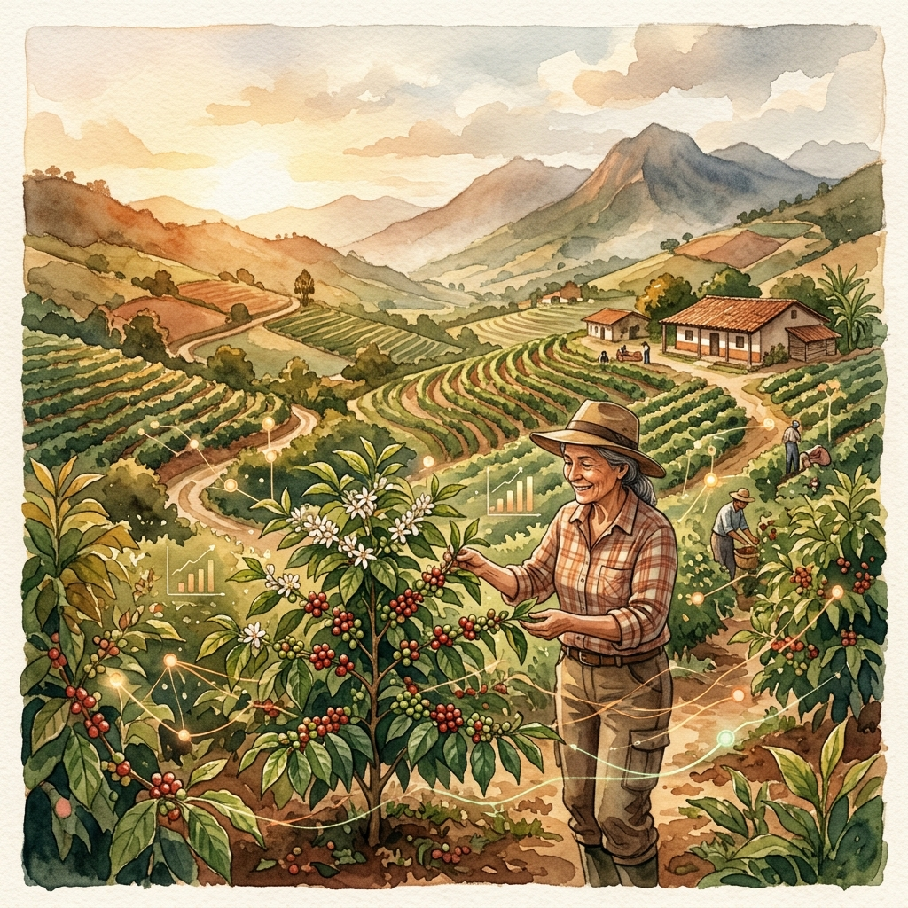
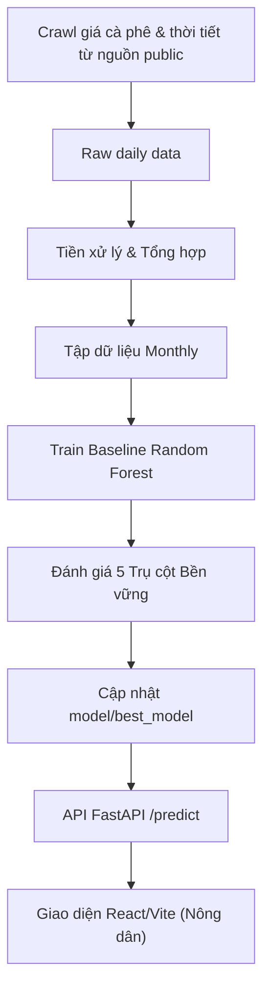

<div align="center">
  

# [AI002] AI Dự Báo Canh Tác & Giá Cà Phê — Nhóm 10

**Đồ án Môn học — Tư duy Trí tuệ Nhân tạo (AI002)**  
 _Đề tài DT10: AI dự báo kế hoạch canh tác mùa vụ và giá cà phê cho nông dân dựa trên 5 Trụ cột của AI Bền vững._

[](https://www.python.org/)
[](https://fastapi.tiangolo.com/)
[](https://scikit-learn.org/)
[](https://www.uit.edu.vn/)
[](https://www.uit.edu.vn/)

</div>

<br/>

## Mục lục

- [Thông tin Môn học](#thông-tin-môn-học)
- [Mục tiêu Đồ án](#mục-tiêu-đồ-án)
- [Công nghệ sử dụng](#công-nghệ-sử-dụng)
- [Cấu trúc Dự án](#cấu-trúc-dự-án)
- [Hướng dẫn Khởi chạy](#hướng-dẫn-khởi-chạy)
- [Chi tiết Học thuật](#chi-tiết-học-thuật)
  - [Lộ trình & Tiến độ](#lộ-trình--tiến-độ)
  - [Luồng Dữ liệu & AI](#luồng-dữ-liệu--ai)
  - [Phân chia Công việc (WBS)](#phân-chia-công-việc-wbs)
  - [Điều lệ Nhóm](#điều-lệ-nhóm)
  - [Báo cáo & Nộp bài](#báo-cáo--nộp-bài)

---

## Thông tin Môn học

- **Môn học:** Tư duy Trí tuệ Nhân tạo (AI002)
- **Lớp:** AI002.F21.CN1.TTNT
- **Cơ sở:** Trường Đại học Công nghệ Thông tin (UIT), Đại học Quốc gia Thành phố Hồ Chí Minh (VNU-HCM)
- **Giảng viên:** TS. Phan Thế Duy
- **Học kỳ:** 2025–2026 (Học kỳ 2)

## Mục tiêu Đồ án

Đồ án tập trung phát triển hệ thống **Trí tuệ Nhân tạo dự báo giá cà phê** và hỗ trợ ra quyết định canh tác cho nông dân tại Tây Nguyên. Điểm cốt lõi của dự án là việc thiết kế và đánh giá hệ thống dựa trên **5 Trụ cột của AI Bền vững (Responsible AI)**: Tính tin cậy (Reliability), Tính không thiên vị (Bias), Kháng nhiễu (Robustness), Tác động xã hội (Social Impact), và Tính minh bạch/Giải thích được (Explainability/Transparency).

**Kết quả cốt lõi:**

1. Thu thập và xử lý tập dữ liệu thực tế về giá cà phê và khí tượng khu vực Tây Nguyên (2020-2026).
2. Xây dựng mô hình Random Forest dự báo giá cà phê hàng tháng.
3. Tích hợp kịch bản kiểm thử kháng nhiễu (Stress test) và bảo vệ hệ thống với cấu hình nhắc nhở an toàn (Prompt Guardrails).
4. Phân tích độ quan trọng của đặc trưng (Feature Importance) để diễn giải logic dự báo.
5. Triển khai API (FastAPI) và giao diện Web (React/Vite) trực quan tiếp cận người dùng cuối.

> **Tài liệu đầy đủ** (kiến trúc, thiết kế AI bền vững, phân tích chi tiết):  
> Xem **[Báo cáo Thiết kế Dự án (PDR)](./docs/project-overview-pdr.md)**.

---

## Công nghệ sử dụng

| Danh mục             | Công nghệ                                                                                                                                                                                                                                                                                            |
| :------------------- | :--------------------------------------------------------------------------------------------------------------------------------------------------------------------------------------------------------------------------------------------------------------------------------------------------- |
| **Backend / API**    |                                                                                                                          |
| **Machine Learning** |                                                                                          |
| **Data & Storage**   |                                                |
| **Frontend**         |    |

---

## Cấu trúc Dự án

```text
AI002_PROJECT/
│
├── docs/                           # Tài liệu dự án (PDR, Báo cáo, Roadmap)
├── data/                           # Datasets (Bỏ qua Git phần raw)
│   ├── raw/                        # Dữ liệu thô (gitignore)
│   └── processed/                  # Dữ liệu đã làm sạch & tiền xử lý
│
├── crawler/                        # Scripts cào và xử lý dữ liệu
├── notebooks/                      # Jupyter Notebooks phân tích (EDA)
│
├── model/                          # AI/ML Core
│   ├── preprocess.py               # Làm sạch, tạo đặc trưng, chia dữ liệu theo thời gian
│   ├── train_rf.py                 # Huấn luyện baseline Random Forest
│   ├── stress_test.py              # Đánh giá kháng nhiễu (Robustness)
│   └── best_model/                 # Checkpoint mô hình tốt nhất (metadata & model.pkl)
│
├── backend/                        # API Server
│   ├── main.py                     # Entry point FastAPI
│   ├── api/routes.py               # Các endpoints: /health, /predict, /model/info
│   └── services/predictor.py       # Tải model, dự đoán và giải thích (Explainability)
│
├── tests/ai-tests/                 # Pytest suite cho các modules AI/Backend
│
└── frontend/                       # Web demo Mobile-first (React/Vite)
```

> 📚 **Tài liệu Subsystem:**
>
> - [Backend API Server](./backend/README.md)
> - [Crawler & Dữ liệu](./crawler/README.md)
> - [Mô hình AI](./model/README.md)
> - [Giao diện Frontend](./frontend/README.md)

---

## Hướng dẫn Khởi chạy

### 1. Điều kiện tiên quyết

- **Python 3.9+**
- **Git**

### 2. Cài đặt

```bash
git clone <repository-url>
cd AI002-Team10-DT10

# Tạo và kích hoạt môi trường ảo
python3 -m venv venv
source venv/bin/activate  # Trên Windows: venv\Scripts\activate

# Cài đặt thư viện
pip install -r requirements.txt
```

### 3. Huấn luyện Mô hình Baseline

```bash
# Huấn luyện Random Forest baseline trên dataset chính thức theo tháng
python3 model/train_rf.py --data data/processed/monthly/coffee_environment_all_areas_monthly_2020_2026.csv --tag rf_monthly_baseline

# Tùy chọn: Đánh giá mô hình XGBoost so sánh
python3 model/train_xgboost.py --data data/processed/monthly/coffee_environment_all_areas_monthly_2020_2026.csv

# Xem lịch sử quá trình huấn luyện
cat model/experiments.csv
```

### 4. Chạy Backend API Server

Khởi động server FastAPI:

```bash
uvicorn backend.main:app --reload
```

**Các Endpoint chính:**

- `/health`: Kiểm tra trạng thái API và mô hình.
- `/predict`: Dự báo giá cà phê kèm khoảng tin cậy và giải thích.
- `/model/info`: Xem siêu dữ liệu của mô hình (version, đặc trưng,...).

_Truy cập [http://localhost:8000/docs](http://localhost:8000/docs) để xem Swagger UI._ (Chi tiết deploy/local self-host xem [tại đây](./docs/deployment.md)).

### 5. Chạy Giao diện Frontend

Mở Terminal mới và chạy:

```bash
# Terminal 1: chạy backend
export $(cat .env | xargs) && python3 -m uvicorn backend.main:app --host 0.0.0.0 --port 8000

# Terminal 2: chạy frontend Vite
cd frontend
npm install
npm run dev
```

Mở trình duyệt tại URL được hiển thị (thường là `http://localhost:5173`).

### 6. Chạy Kiểm thử (Tests)

```bash
# Chạy bộ test cho Backend và AI
python3 -m pytest tests/ai-tests -q
```

---

## Chi tiết Học thuật

> Các thông tin phục vụ quá trình chấm điểm, đánh giá quá trình làm việc của đồ án AI002.

---

### Lộ trình & Tiến độ

Các mốc chính bao gồm:

1. Thu thập dữ liệu thực tế (Giá, thời tiết, thổ nhưỡng).
2. Xây dựng Data-to-AI pipeline & Tiền xử lý dữ liệu.
3. Train Random Forest Baseline.
4. Tích hợp 5 Trụ cột AI Bền vững & Viết Backend.
5. Ghép nối Frontend & Viết báo cáo cuối kỳ.

Xem chi tiết tại: **[docs/project-roadmap.md](./docs/project-roadmap.md)**

---

### Luồng Dữ liệu & AI

Luồng làm việc hiện tại sử dụng dataset chính thức được thu thập và tái tạo từ nguồn public, gồm giá cà phê, thời tiết lịch sử và hồ sơ đất theo khu vực, tổng hợp theo tháng để huấn luyện `RandomForestRegressor`. Đây là chiến lược giúp dự đoán giá cả ổn định, dễ giải thích và bám sát nguyên tắc **KISS** (Keep It Simple, Stupid) của thiết kế AI.



**Tập dữ liệu huấn luyện chính:**

- File: `data/processed/monthly/coffee_environment_all_areas_monthly_2020_2026.csv`
- Kích thước: 912 dòng, 18 cột
- Phân chia (Temporal Split): Huấn luyện 2020-2024, Kiểm thử 2025, giữ 2026-01 đến 2026-04 làm demo/inference/audit holdout.

---

### Điều lệ Nhóm

- **Mục tiêu:** Áp dụng thuần thục 5 trụ cột AI Bền vững vào bài toán thực tiễn.
- **Tiến độ:** Tuân thủ các mốc thời gian đã cam kết trong Roadmap.
- **Mã nguồn:** Toàn bộ thay đổi phải bám sát thiết kế kiến trúc và có báo cáo thay đổi.
- **Tài liệu hóa:** Mọi quyết định thay đổi về luồng dữ liệu đều phải lưu lại biên bản trong thư mục `docs/discussions/`.

### Danh sách Nhóm — Nhóm 10

| MSSV     | Họ và Tên      | Vai trò                                      | Trục AI Phụ trách                          | GitHub                                                             |
| :------- | :------------- | :------------------------------------------- | :----------------------------------------- | :----------------------------------------------------------------- |
| 25730067 | Đặng Chí Thanh | Trưởng nhóm, Kỹ thuật ML, Backend & Frontend | Reliability, Explainability, Social Impact | [@uit-25730067-chithanh](https://github.com/uit-25730067-chithanh) |
| 25730061 | Hoàng Cao Sơn  | Data Audit, Crawler, Stress test             | Robustness, Bias                           | [@uit-25730061-caoson](https://github.com/uit-25730061-caoson)     |

_(Lưu ý: Do đây là repo public, GitHub handle của một số thành viên có thể được cập nhật sau)_

---

### Báo cáo & Nộp bài

Toàn bộ báo cáo, phụ lục, tài liệu thiết kế và slide thuyết trình được lưu trữ trong thư mục `docs/report/final-ai002-report`. Bản nén cuối cùng bao gồm báo cáo PDF, source code và model weights sẽ được nộp trên hệ thống của trường đúng thời hạn yêu cầu.

<br/>

<div align="center">
  <i>AI002 — Tư duy Trí tuệ Nhân tạo</i><br/>
  <i>Trường Đại học Công nghệ Thông tin (UIT) · VNU-HCM · 2026</i>
</div>
