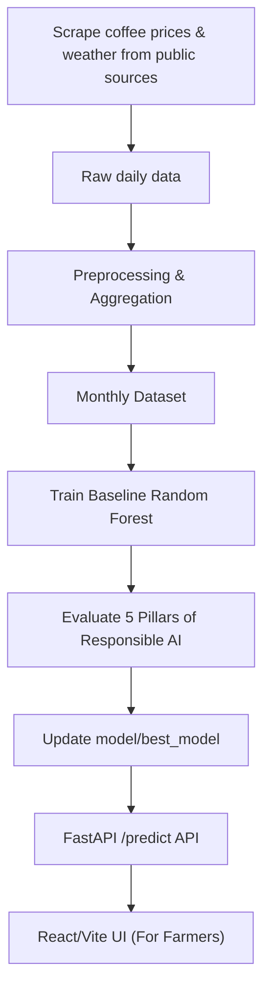

<div align="center">
  

# [AI002] AI Coffee Price & Farming Advisory Forecast — Team 22

**Course Project — AI Design Thinking (AI002)**  
 _Topic DT10: AI-powered seasonal farming plan and coffee price forecasting for farmers based on the 5 Pillars of Responsible AI._

[](https://www.python.org/)
[](https://fastapi.tiangolo.com/)
[](https://scikit-learn.org/)
[](https://www.uit.edu.vn/)
[](https://www.uit.edu.vn/)

</div>

<br/>

## Table of Contents

- [Course Information](#course-information)
- [Project Objectives](#project-objectives)
- [Technologies Used](#technologies-used)
- [Project Structure](#project-structure)
- [Getting Started](#getting-started)
- [Academic Details](#academic-details)
  - [Roadmap & Progress](#roadmap--progress)
  - [Data & AI Pipeline](#data--ai-pipeline)
  - [Work Breakdown Structure (WBS)](#work-breakdown-structure-wbs)
  - [Team Charter](#team-charter)
  - [Reports & Deliverables](#reports--deliverables)

---

## Course Information

- **Course:** AI Design Thinking (AI002)
- **Class:** AI002.F21.CN1.TTNT
- **Institution:** University of Information Technology (UIT), Vietnam National University - Ho Chi Minh City (VNU-HCM)
- **Instructor:** Dr. Phan The Duy
- **Academic Term:** 2025–2026 (Semester 2)

## Project Objectives

This project focuses on developing an **AI-powered coffee price forecasting and farming decision support system** for farmers in the Central Highlands (Tay Nguyen) of Vietnam. The core highlight of the project is the design and evaluation of the system based on the **5 Pillars of Responsible AI**: Reliability, Bias, Robustness, Social Impact, and Transparency/Explainability.

**Key Deliverables:**

1. Collect and preprocess a real-world dataset on coffee prices and meteorological parameters in the Central Highlands (2020-2026).
2. Build a Random Forest model to forecast monthly coffee prices.
3. Integrate robustness stress-testing scenarios and safeguard the system using prompt guardrails.
4. Analyze feature importances to interpret the forecasting logic.
5. Deploy a visual web interface (React/Vite) and API (FastAPI) accessible to end-users.

> **Full Documentation** (architecture, responsible AI design, detailed analysis):  
> Refer to the **[Project Design Report (PDR)](./docs/project-overview-pdr.md)**.

---

## Technologies Used

| Category             | Technologies                                                                                                                                                                                                                                                                                         |
| :------------------- | :--------------------------------------------------------------------------------------------------------------------------------------------------------------------------------------------------------------------------------------------------------------------------------------------------- |
| **Backend / API**    |                                                                                                                          |
| **Machine Learning** |                                                                                                                                                                                |
| **Data & Storage**   |                                                |
| **Frontend**         |    |

---

## Project Structure

```text
AI002_PROJECT/
│
├── docs/                           # Project documentation (PDR, Reports, Roadmap)
├── data/                           # Datasets (Raw ignored in Git)
│   ├── raw/                        # Raw data (gitignore)
│   └── processed/                  # Cleaned & preprocessed data
│
├── crawler/                        # Data scraping and processing scripts
├── notebooks/                      # Jupyter Notebooks for EDA
│
├── model/                          # AI/ML Core
│   ├── preprocess.py               # Data cleaning, feature engineering, temporal splitting
│   ├── train_rf.py                 # Baseline Random Forest training
│   ├── stress_test.py              # Robustness evaluation (Stress test)
│   └── best_model/                 # Best model checkpoint (metadata & model.pkl)
│
├── backend/                        # API Server
│   ├── main.py                     # FastAPI entry point
│   ├── api/routes.py               # Endpoints: /health, /predict, /model/info
│   └── services/predictor.py       # Model loading, inference, and explainability
│
├── tests/ai-tests/                 # Pytest suite for AI/Backend modules
│
└── frontend/                       # Mobile-first Web Demo (React/Vite)
```

> 📚 **Subsystem Documentation:**
>
> - [Backend API Server](./backend/README.md)
> - [Crawler & Data](./crawler/README.md)
> - [AI Model](./model/README.md)
> - [Frontend UI](./frontend/README.md)

---

## Getting Started

### 1. Prerequisites

- **Python 3.9+**
- **Git**

### 2. Installation

```bash
git clone <repository-url>
cd AI002-Team22-DT10

# Create and activate a virtual environment
python3 -m venv venv
source venv/bin/activate  # On Windows: venv\Scripts\activate

# Install required libraries
pip install -r requirements.txt
```

### 3. Train the Baseline Model

```bash
# Train the baseline Random Forest on the official monthly dataset
python3 model/train_rf.py --data data/processed/monthly/coffee_environment_all_areas_monthly_2020_2026.csv --tag rf_monthly_baseline

# View training history logs
cat model/experiments.csv
```

### 4. Run the Backend API Server

Start the FastAPI server:

```bash
uvicorn backend.main:app --reload
```

**Main Endpoints:**

- `/health`: Verify API and model status.
- `/predict`: Get coffee price forecasts with confidence intervals and explainability metrics.
- `/model/info`: View model metadata (version, feature list, etc.).

_Access [http://localhost:8000/docs](http://localhost:8000/docs) to view the Swagger UI._ (For deployment or local self-hosting instructions, see [here](./docs/deployment.md)).

### 5. Run the Frontend UI

Open a new terminal and run:

```bash
# Terminal 1: Run the backend
export $(cat .env | xargs) && python3 -m uvicorn backend.main:app --host 0.0.0.0 --port 8000

# Terminal 2: Run the Vite frontend
cd frontend
npm install
npm run dev
```

Open your browser at the displayed URL (typically `http://localhost:5173`).

### 6. Run Tests

```bash
# Run the test suite for the Backend and AI components
python3 -m pytest tests/ai-tests -q
```

---

## Academic Details

> Information for academic evaluation and tracking the progress of the AI002 project.

---

### Roadmap & Progress

The main milestones include:

1. Real-world data collection (prices, weather, soil profiles).
2. Data-to-AI pipeline & preprocessing.
3. Training the Random Forest baseline.
4. Integrating the 5 Pillars of Responsible AI & developing the Backend.
5. Frontend integration & final report writing.

For details, refer to: **[docs/project-roadmap.md](./docs/project-roadmap.md)**

---

### Data & AI Pipeline

The current pipeline uses an official dataset scraped and reconstructed from public sources, including historical weather, coffee prices, and soil profiles aggregated monthly to train a `RandomForestRegressor`. This monthly strategy ensures stable, explainable price predictions in line with the **KISS** (Keep It Simple, Stupid) design philosophy.



**Core Training Dataset:**

- File: `data/processed/monthly/coffee_environment_all_areas_monthly_2020_2026.csv`
- Size: 912 rows, 18 columns
- Temporal Split: Train: 2020-2024, Test: 2025, Holdout (Inference & Audit): 2026-01 to 2026-04.

---

### Team Charter

- **Objective:** Successfully apply the 5 Pillars of Responsible AI to a real-world problem.
- **Timeline:** Strictly follow the milestones committed in the Roadmap.
- **Codebase:** All changes must align with the architectural design and include change reports.
- **Documentation:** All decisions regarding data flow changes must be logged in `docs/discussions/`.

### Team Members — Team 22

| Student ID | Full Name      | Role                                        | Responsible AI Focus Areas                 | GitHub                                                             |
| :--------- | :------------- | :------------------------------------------ | :----------------------------------------- | :----------------------------------------------------------------- |
| 25730067   | Dang Chi Thanh | Team Lead, ML Engineer, Backend & Frontend   | Reliability, Explainability, Social Impact | [@uit-25730067-chithanh](https://github.com/uit-25730067-chithanh) |
| 25730061   | Hoang Cao Son  | Data Auditor, Crawler Developer, Stress test | Robustness, Bias                           | [@uit-25730061-caoson](https://github.com/uit-25730061-caoson)     |

_(Note: As this is a public repository, some members' GitHub handles may be updated later)_

---

### Reports & Submission

All reports, appendices, design specifications, and presentation slides are stored under `docs/report/final-ai002-report`. The final submission archive (including PDF report, source code, and model weights) will be uploaded to the university portal by the official deadline.
<br/>

<div align="center">
  <i>AI002 — AI Design Thinking</i><br/>
  <i>University of Information Technology (UIT) · VNU-HCM · 2026</i>
</div>
