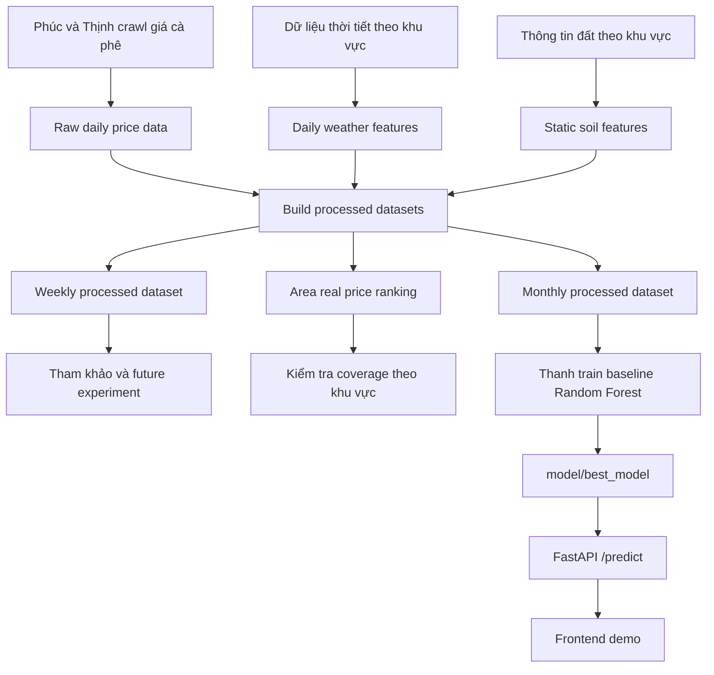
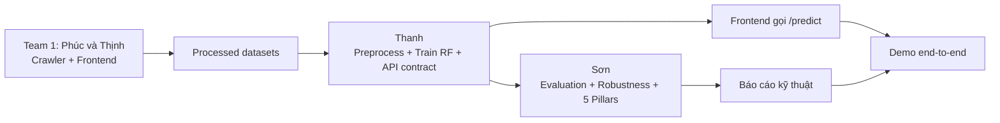

<div align="center">
  

# AI-Powered Agricultural Market Analysis (DT10)

**University Project - Artificial Intelligence Thinking (AI002)**  
 _Topic DT10: AI predicting crop planning and coffee prices for farmers._

[](https://www.python.org/)
[](https://fastapi.tiangolo.com/)
[](https://scikit-learn.org/)
[](https://opensource.org/licenses/MIT)

</div>

<br/>

## Table of Contents

- [Overview](#overview)
- [Data-to-AI Flow](#data-to-ai-flow)
- [Tech Stack](#tech-stack)
- [Project Structure](#project-structure)
- [Getting Started](#getting-started)
- [Team Structure](#team-structure-team-10)

---

## Overview

This project implements an **Artificial Intelligence model** designed to analyze and predict agricultural market prices, specifically focusing on **coffee**. By leveraging historical price data and environmental factors, the system assists farmers in making data-driven farming and financial decisions.

> **Deep Dive Documentation:**
> For an in-depth look at our core system design, including the **5 Pillars of Sustainable AI**, rationale behind our architecture, and detailed team workflows, please refer to our **[Project Design Report (PDR)](./docs/project-overview-pdr.md)**.

---

## Data-to-AI Flow

Luồng hiện tại dùng dữ liệu thật đã xử lý theo tháng để train baseline Random Forest. Raw data crawl rất nhiều nhưng nằm trong `data/raw/` và bị gitignore, nên model trong repo không train trực tiếp từ raw file. Team 2 chọn `data/processed/monthly/coffee_environment_all_areas_monthly_2022_2025.csv` vì độ phủ giá thật ổn định hơn, dễ giải thích hơn và phù hợp mục tiêu KISS của môn học.



### Dataset chính hiện tại

| Mục                 | Giá trị                                                                     |
| :------------------ | :-------------------------------------------------------------------------- |
| File train chính    | `data/processed/monthly/coffee_environment_all_areas_monthly_2022_2025.csv` |
| Số dòng             | 576                                                                         |
| Số cột              | 16                                                                          |
| Tần suất            | Monthly                                                                     |
| Train/Test          | Train 2022-2024, Test 2025                                                  |
| Model baseline      | `RandomForestRegressor`                                                     |
| Best model metadata | `model/best_model/metadata.json`                                            |

### Trách nhiệm theo team



Tài liệu chi tiết:

- [Team data flow roadmap](./docs/discussions/2026-05-13-team-data-flow-roadmap.md)
- [Project roadmap](./docs/project-roadmap.md)
- [API handoff real data model](./docs/discussions/2026-05-13-api-handoff-team2-real-data.md)
- [Sơn evaluation pack summary](./docs/discussions/2026-05-13-son-evaluation-pack-summary.md)
- [5 Pillars checkpoint](./docs/discussions/5-pillars-checkpoint.md)

---

## Tech Stack

| Category               | Technologies                                                                                                                                                                                                                                                                   |
| :--------------------- | :----------------------------------------------------------------------------------------------------------------------------------------------------------------------------------------------------------------------------------------------------------------------------- |
| **Backend / API**      |                                                                                                    |
| **Machine Learning**   |                                                                    |
| **Data Processing**    |                                                                                                             |
| **Frontend / Crawler** |    |
| **Storage**            |                                                                                        |

---

## Project Structure

```text
AI002_PROJECT/
│
├── docs/                           # Documentation (PDR, Slides, References)
├── data/                           # Datasets (Ignored in Git)
│   ├── raw/                        # Raw scraped data (gitignored)
│   ├── processed/                  # Cleaned & processed data
│   └── external/                   # Optional external data sources
│
├── crawler/                        # Data crawling & scraping scripts
├── notebooks/                      # Jupyter Notebooks for EDA & Prototyping
│
├── model/                          # AI/ML Core (Team 2)
│   ├── preprocess.py               # Data cleaning, feature engineering, temporal split
│   ├── train_rf.py                 # Random Forest baseline training + evaluation
│   ├── train_xgboost.py            # Optional XGBoost comparison (requires venv)
│   ├── stress_test.py              # Robustness stress test (Black Swan scenarios)
│   └── best_model/                 # Promoted model metadata and .pkl artifact
│
├── backend/                        # API Server (Team 2)
│   ├── main.py                     # FastAPI entry point
│   ├── api/routes.py               # Endpoints: /health, /predict, /model/info
│   ├── schemas/prediction.py       # Pydantic request/response validation
│   └── services/predictor.py       # Model loading, inference, explanations
│
├── tests/ai-tests/                 # Pytest suite
│   └── test_predictor_service.py   # PredictorService unit tests
│
└── frontend/                       # Web Interface (Team 1)
```

> _For detailed team responsibilities across these modules, see the [Team Workflows](./docs/project-overview-pdr.md#4-phân-công-công-việc)._

---

## Getting Started

### 1. Prerequisites

Ensure you have the following installed:

- **Python 3.9+**
- **Git**

### 2. Installation

Clone the repository and install the required dependencies:

```bash
git clone <repository-url>
cd AI002_PROJECT

# Create and activate virtual environment
python3 -m venv venv
source venv/bin/activate  # On Windows: venv\Scripts\activate

# Install dependencies
pip install -r requirements.txt
```

### 3. Running the Backend API

Start the FastAPI server (supports running from project root or `backend/`):

```bash
uvicorn backend.main:app --reload
# or: cd backend && uvicorn main:app --reload
```

**API Endpoints:**

| Endpoint      | Method | Description                                                  |
| :------------ | :----- | :----------------------------------------------------------- |
| `/health`     | GET    | Check API status and model load state                        |
| `/predict`    | POST   | Predict coffee price with confidence interval + explanations |
| `/model/info` | GET    | Model metadata (version, features, training timestamp)       |

**Tip:** Navigate to `http://localhost:8000/docs` for interactive Swagger UI.

### 4. Running Tests

```bash
# Predictor service tests (skip gracefully if model not yet trained)
python3 -m pytest tests/ai-tests/test_predictor_service.py -q
```

### 5. Training the Baseline Model

```bash
# Train Random Forest baseline trên data thật monthly
python3 model/train_rf.py --data data/processed/monthly/coffee_environment_all_areas_monthly_2022_2025.csv --tag rf_real_monthly

# Optional only: XGBoost comparison (install in a separate venv)
python3 model/train_xgboost.py --data data/processed/monthly/coffee_environment_all_areas_monthly_2022_2025.csv

# Xem lịch sử experiments
cat model/experiments.csv
```

### 6. Running the Web UI

Simply open `frontend/index.html` in your preferred web browser to view the dashboard.

---

## Team Structure (Team 10)

|    Team    | Members      | Responsibilities                                              |
| :--------: | :----------- | :------------------------------------------------------------ |
| **Team 1** | Phúc & Thịnh | Data Crawling, Frontend UI Development, Presentation Slides   |
| **Team 2** | Thanh & Sơn  | Core ML Engineering, Model Training & Evaluation, Backend API |

<br/>

<div align="center">
  <i>Built with passion for Sustainable Agriculture.</i>
</div>
