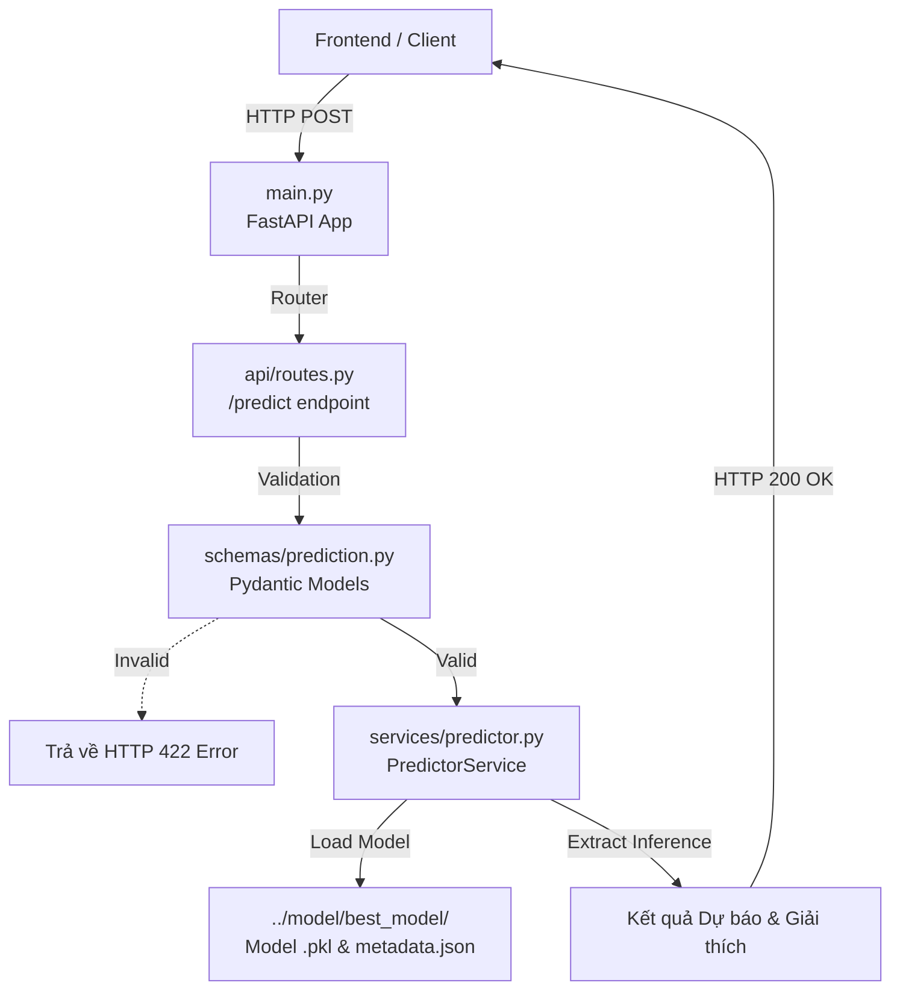

# ⚙️ Backend (API Server)

Thư mục này chứa mã nguồn Backend (FastAPI) phục vụ API dự báo giá cà phê và cung cấp endpoint cho giao diện người dùng.

## 1. Vai trò

- **Entry point:** Chạy ứng dụng FastAPI server, quản lý vòng đời ứng dụng.
- **RESTful API:** Cung cấp các endpoint cho dự báo (`/predict`), kiểm tra trạng thái (`/health`), và thông tin model (`/model/info`).
- **Data Validation:** Sử dụng Pydantic để validate tính hợp lệ của dữ liệu đầu vào.
- **Inference Layer:** Tải model Machine Learning đã được train và thực hiện suy luận.

## 2. Sơ đồ luồng xử lý (Data Flow & Architecture)

## 3. Chức năng các file chính

- **`main.py`**: Khởi tạo app FastAPI, cấu hình CORS, đăng ký routers.
- **`api/routes.py`**: Định nghĩa các API endpoints.
- **`schemas/prediction.py`**: Chứa các Pydantic schema dùng cho tính chặt chẽ của Request và Response.
- **`services/predictor.py`**: Lớp Service quản lý việc load file model (`.pkl`), tiền xử lý nhanh và suy luận ra kết quả.
- **`services/farming_advisory.py`**: Chứa logic rule-based đưa ra lời khuyên canh tác dựa trên các thông số môi trường.

## 4. Roadmap Tiến độ

- [x] Khởi tạo FastAPI Skeleton
- [x] Tích hợp cấu hình CORS an toàn
- [x] Viết Schemas Validation với Pydantic (Data Robustness)
- [x] Xây dựng Service tích hợp mô hình Random Forest thật
- [ ] Thêm caching để tối ưu tốc độ phản hồi (Tương lai)
- [ ] Mở rộng Explainability chi tiết hơn trong Response (Tương lai)
