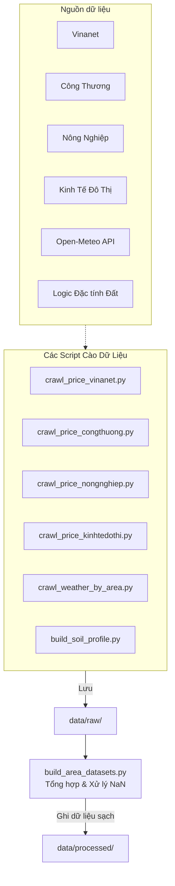

# 🕷️ Crawler (Data Collection)

Thư mục này chịu trách nhiệm thu thập, làm sạch cơ bản và tổ chức dữ liệu phục vụ huấn luyện mô hình. Nó xử lý cả giá cà phê, thời tiết, và dữ liệu đặc tính đất đai theo khu vực.

## 1. Vai trò

- Tự động cào (crawl) dữ liệu giá cả từ các trang báo nông nghiệp.
- Cào dữ liệu thời tiết quá khứ từ Open-Meteo.
- Xây dựng profile tĩnh về đất đai cho từng tỉnh.
- Hợp nhất và xây dựng bộ dữ liệu (dataset) theo chu kỳ tuần/tháng.

## 2. Sơ đồ luồng xử lý (Data Flow & Architecture)



## 3. Chức năng các file chính

- **`price_crawler_common.py`**: Lớp dùng chung (Base Class) xử lý HTML parsing, lưu trữ file trung gian và logic chống lỗi.
- **`crawl_price_*.py`**: Các script cụ thể cho từng trang web.
- **`run_price_crawlers.py`**: Orchestrator chạy song song/tuần tự các crawlers với timeout an toàn.
- **`crawl_weather_by_area.py`**: Lấy API thời tiết lịch sử.
- **`build_area_datasets.py`**: Hợp nhất các file CSV rời rạc từ `data/raw/` thành bộ dataset tiêu chuẩn (monthly/weekly) đưa vào `data/processed/`.

## 4. Hướng dẫn chạy nhanh

Để cào dữ liệu từ 2022 đến 2025:

```bash
python crawler/crawl_coffee_prices.py --start 2022-01-01 --end 2025-12-31
python crawler/crawl_weather_by_area.py --start 2022-01-01 --end 2025-12-31
python crawler/build_soil_profile.py
python crawler/build_area_datasets.py --freq weekly
python crawler/build_area_datasets.py --freq monthly
```

*(Lưu ý: Bạn cũng có thể dùng `run_price_crawlers.py` nếu muốn chạy song song nhiều nguồn).*

## 5. Roadmap Tiến độ

- [x] Crawl nhiều nguồn báo chí để đảm bảo độ bao phủ giá cà phê (Reliability)
- [x] Crawl dữ liệu thời tiết tự động
- [x] Xây dựng profile tĩnh về Đất (Soil Profile)
- [x] Hợp nhất dữ liệu, xử lý missing data logic phức tạp (Area median, Proxy)
- [ ] Tích hợp cơ chế auto-retry thông minh hơn (Tương lai)
- [ ] Chạy crawler bằng GitHub Actions theo lịch (Tương lai)
