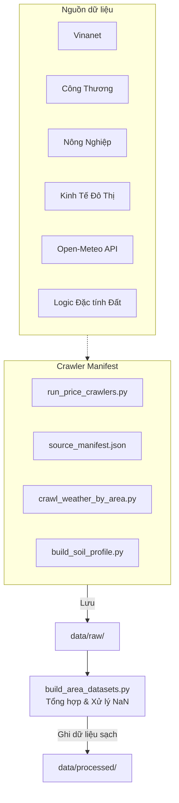

# 🕷️ Crawler (Data Collection)

Thư mục này chịu trách nhiệm thu thập, làm sạch cơ bản và tổ chức dữ liệu phục vụ huấn luyện mô hình. Nó xử lý cả giá cà phê, thời tiết, và dữ liệu đặc tính đất đai theo khu vực.

## 1. Vai trò

- Tự động cào (crawl) dữ liệu giá cả từ các trang báo nông nghiệp theo `source_manifest.json`.
- Cào dữ liệu thời tiết quá khứ từ Open-Meteo.
- Xây dựng profile tĩnh về đất đai cho từng tỉnh.
- Hợp nhất và xây dựng bộ dữ liệu (dataset) theo chu kỳ tuần/tháng.

## 2. Sơ đồ luồng xử lý (Data Flow & Architecture)



## 3. Chức năng các file chính

- **`source_manifest.json`**: Danh sách nguồn public, seed URL và output path chính thức.
- **`run_price_crawlers.py`**: Orchestrator chạy các nguồn theo manifest với timeout an toàn.
- **`price_crawler_common.py`**: Parser/helper dùng chung cho HTML, giá, ngày, vùng và merge raw output.
- **`crawl_weather_by_area.py`**: Lấy API thời tiết lịch sử.
- **`build_area_datasets.py`**: Hợp nhất các file CSV rời rạc từ `data/raw/` thành monthly dataset chính; weekly chỉ tái tạo khi cần tham khảo.

## 4. Hướng dẫn chạy nhanh

Để cào dữ liệu từ 2022 đến 2025:

```bash
python crawler/run_price_crawlers.py --seed-only
python crawler/crawl_weather_by_area.py --start 2020-01-01 --end 2026-04-30
python crawler/build_soil_profile.py
python crawler/build_area_datasets.py --freq monthly
```

Các wrapper crawler theo từng nguồn cũ đã đưa ra khỏi repo hiện tại để repo gọn hơn; manifest hiện là luồng chính.

## 5. Roadmap Tiến độ

- [x] Crawl nhiều nguồn báo chí để đảm bảo độ bao phủ giá cà phê (Reliability)
- [x] Crawl dữ liệu thời tiết tự động
- [x] Xây dựng profile tĩnh về Đất (Soil Profile)
- [x] Hợp nhất dữ liệu, xử lý missing data logic phức tạp (Area median, Proxy)
- [ ] Tích hợp cơ chế auto-retry thông minh hơn (Tương lai)
- [ ] Chạy crawler bằng GitHub Actions theo lịch (Tương lai)
