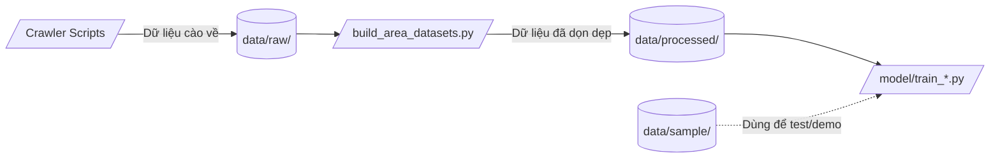

# 🗄️ Data Storage

Thư mục lưu trữ trung tâm cho tất cả các định dạng dữ liệu (CSV/JSON/SQLite) trong vòng đời Machine Learning của dự án. 

> ⚠️ **Lưu ý:** Thư mục này được set trong `.gitignore` nhằm tránh đưa dữ liệu thô (raw) và trung gian dung lượng lớn lên Git (ngoại trừ thư mục `sample/`).

## 1. Vai trò

- Quản lý dữ liệu từ khâu thô ráp đến lúc đã qua tinh chỉnh.
- Tách biệt rõ ràng state của dữ liệu để tránh data leakage và nhầm lẫn.

## 2. Sơ đồ cấu trúc thư mục

## 3. Chức năng các thư mục con

- **`raw/`**: Chứa file CSV đổ về trực tiếp từ Crawler chưa qua mông má. Bao gồm giá cà phê từ nhiều trang báo, thời tiết từ API, và dữ liệu đất. Dữ liệu ở đây có thể chứa chuỗi text, missing values, và nhiễu.
- **`processed/`**: Dữ liệu đã qua làm sạch, fill missing values (NaN), gom nhóm (Weekly/Monthly). Đây là dữ liệu chuẩn hóa, dùng trực tiếp làm Input cho Model Training.
- **`sample/`**: Các file sample mock data (nhỏ, nhẹ) được phép commit lên Git để người mới tải dự án về có thể test chạy thử Pipeline ngay mà không cần crawler data thực. (Ví dụ: dữ liệu mock, toy datasets).

## 4. Roadmap Tiến độ

- [x] Cấu trúc phân lớp thư mục rõ ràng (Raw, Processed, Sample)
- [x] Lưu trữ sample data để hỗ trợ CI/CD và Unit Test nhanh
- [ ] Tích hợp DVC (Data Version Control) để track version của bộ dữ liệu thực tế thay vì dùng Git (Tương lai)
