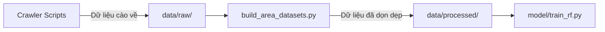

# 🗄️ Data Storage

Thư mục lưu trữ trung tâm cho tất cả các định dạng dữ liệu (CSV/JSON/SQLite) trong vòng đời Machine Learning của dự án. 

> ⚠️ **Lưu ý:** Dữ liệu thô (`data/raw/`) và artifact thử nghiệm lớn không push lên Git. Dự án hiện giữ dataset processed monthly chính thức và các file metadata nhỏ cần cho demo/báo cáo.

## 1. Vai trò

- Quản lý dữ liệu từ khâu thô ráp đến lúc đã qua tinh chỉnh.
- Tách biệt rõ ràng state của dữ liệu để tránh data leakage và nhầm lẫn.

## 2. Sơ đồ cấu trúc thư mục

## 3. Chức năng các thư mục con

- **`raw/`**: Chứa file CSV đổ về trực tiếp từ Crawler chưa qua xử lý. Bao gồm giá cà phê từ nhiều trang báo, thời tiết từ API, và dữ liệu đất. Thư mục này bị ignore để tránh push dữ liệu thô/lớn.
- **`processed/`**: Dữ liệu đã qua làm sạch, fill missing values (NaN), gom nhóm. Dự án hiện giữ **monthly dataset** làm input chính cho model.
- **`processed/weekly/`**: Có thể tái tạo bằng crawler/builder khi cần nghiên cứu, nhưng CSV weekly đã được đưa ra khỏi danh sách file chính vì không dùng làm baseline chính.
- **`sample/`**: Mock sample cũ đã được tách khỏi repo hiện tại; không còn là luồng test/demo hiện tại.

## 4. Roadmap Tiến độ

- [x] Cấu trúc phân lớp thư mục rõ ràng (Raw, Processed, Sample)
- [x] Chuyển từ mock sample sang canonical monthly dataset cho test/demo chính
- [ ] Tích hợp DVC (Data Version Control) để track version của bộ dữ liệu thực tế thay vì dùng Git (Tương lai)
