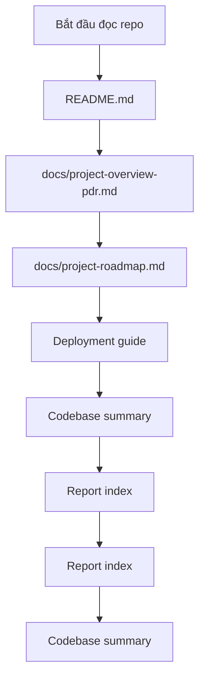
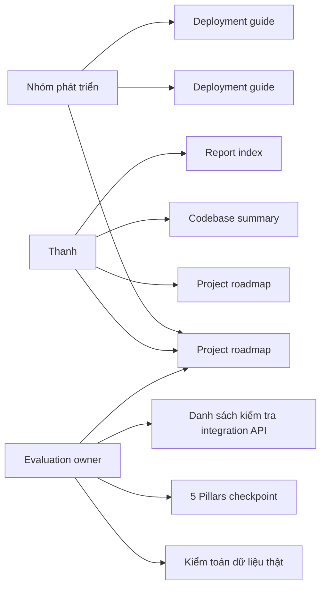

# 📚 Trung tâm Tài liệu Dự án

Thư mục này chứa toàn bộ tài liệu kỹ thuật và quản lý của dự án **AI Dự báo Canh tác & Giá Cà phê (Đề tài 10)**.

## 📖 Phân loại tài liệu (Docs Tiering)

- **Tier 1: Current source-of-truth**: Chứa trạng thái mới nhất, bắt buộc maintain. Chỉ bao gồm các tài liệu chính: `README.md`, `project-overview-pdr.md`, `code-standards.md`, `system-architecture.md`, `codebase-summary.md`, `project-roadmap.md`, `deployment.md`, `troubleshooting.md`.
- **Tier 2: Deliverables (Frozen)**: Các tài liệu đã nộp, đóng băng trạng thái (không maintain): báo cáo cuối kỳ, slide, pdf.
- **Tier 3: Archive evidence**: Bằng chứng, thảo luận lịch sử, note theo tuần. Không dùng làm source-of-truth hiện tại: `docs/discussions/`, `docs/report/internal-notes/`.
- **Tier 4: Noise**: Đã được xóa bỏ hoặc bỏ qua.
## 📖 Mục lục

- [Project Overview (PDR)](project-overview-pdr.md): Kiến trúc cốt lõi, 5 Trụ cột AI Bền vững và phân công nhiệm vụ.
- [Tiêu chuẩn Code (Code Standards)](code-standards.md): Các quy tắc lập trình, quy trình Git và ràng buộc AI.
- [Tóm tắt Codebase (Codebase Summary)](codebase-summary.md): Giải thích chi tiết các phân hệ (`backend`, `model`, `crawler`, `frontend`).
- [Kiến trúc Hệ thống (System Architecture)](system-architecture.md): Sơ đồ luồng dữ liệu, kiến trúc API FastAPI và tích hợp 5 Trụ cột AI Bền vững.
- [Lộ trình Dự án (Roadmap)](project-roadmap.md): Lịch trình phát triển, biểu đồ Gantt và phân công WBS.
- [Archive Evidence Index - Discussions](discussions/README.md): Chỉ mục archive cho tài liệu thảo luận lịch sử.
- [Robustness Stress Test](discussions/robustness-stress-test.md): Bằng chứng stress test cho mô hình hiện tại.
- [Soil Score Guide](discussions/soil_score_guide.md): Hướng dẫn diễn giải điểm đất.
- [Archive Evidence Index - Discussions](discussions/README.md): Chỉ mục archive cho toàn bộ tài liệu thảo luận.
- [Report Index](report/README.md): Chỉ mục báo cáo theo tuần (`internal-notes/`) và báo cáo chính thức (`final-ai002-report/`).
- [Slides Thuyết trình](slides/final_presentation_slides.md): Các slide dùng cho báo cáo cuối kỳ.
- [Hướng dẫn Triển khai & Self-host](deployment.md): Hướng dẫn deploy Cloudflare Pages (Frontend), Render (Backend) và chạy server Local.
- [Sửa lỗi (Troubleshooting)](troubleshooting.md): Hướng dẫn khắc phục các lỗi thường gặp khi chạy dự án.
## 🧭 Luồng đọc nhanh cho thành viên mới

## Luồng đọc theo nhu cầu

| Bạn cần làm gì? | Đọc tài liệu nào trước | Kết quả cần đạt |
| --- | --- | --- |
| Hiểu dự án trong 10 phút | `README.md`, `project-overview-pdr.md` | Nắm đề tài, phạm vi, 5 trụ cột |
| Nối frontend với backend | `deployment.md`, `troubleshooting.md` | Biết payload, response, API key, lỗi thường gặp |
| Chạy API để demo | `deployment.md`, `troubleshooting.md` | Mở được `/health`, `/docs`, `/model/info` |
| Deploy backend cho demo | Người phụ trách backend chọn nền tảng, sau đó chia sẻ base URL + API key nội bộ | Frontend biết URL, header auth và cách báo lỗi |
| Viết báo cáo cuối kỳ | `5-pillars-checkpoint.md`, `project-roadmap.md`, `report/README.md` | Có bằng chứng Reliability/Bias/Robustness/Social Impact/Transparency |

## 🔗 Tài liệu theo vai trò

