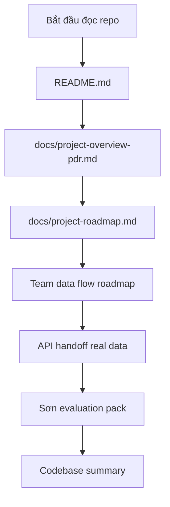
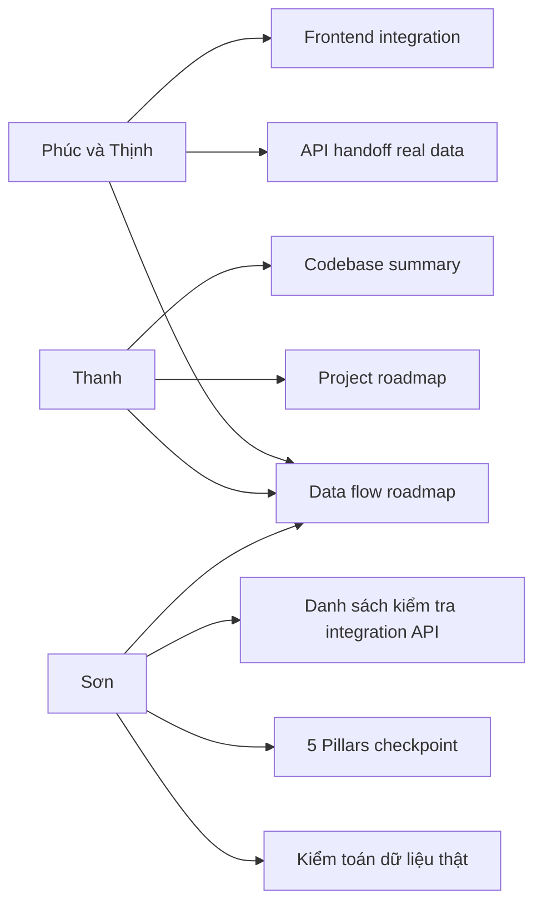

# 📚 Trung tâm Tài liệu Dự án

Thư mục này chứa toàn bộ tài liệu kỹ thuật và quản lý của dự án **AI Dự báo Canh tác & Giá Cà phê (Đề tài 10 - Team 10)**.

## 📖 Mục lục

- [Project Overview (PDR)](project-overview-pdr.md): Kiến trúc cốt lõi, 5 Trụ cột AI Bền vững và phân công nhiệm vụ.
- [Tiêu chuẩn Code (Code Standards)](code-standards.md): Các quy tắc lập trình, quy trình Git và ràng buộc AI.
- [Tóm tắt Codebase (Codebase Summary)](codebase-summary.md): Giải thích chi tiết các phân hệ (`backend`, `model`, `crawler`, `frontend`).
- [Lộ trình Dự án (Roadmap)](project-roadmap.md): Lịch trình phát triển, biểu đồ Gantt và phân công WBS.
- [Team Data Flow Roadmap](discussions/2026-05-13-team-data-flow-roadmap.md): Luồng dữ liệu thật từ crawler → processed dataset → model → API → frontend.
- [API Handoff Real Data](discussions/2026-05-13-api-handoff-team2-real-data.md): Contract `/predict` cho frontend khi dùng model real-data.
- [Sơn Evaluation Pack](discussions/2026-05-13-son-evaluation-pack-summary.md): Tổng hợp kiểm toán dữ liệu thật, QA integration và 5 Pillars bằng chứng từ PR #12.
- [Real Data Audit](discussions/2026-05-13-real-data-audit-team2-son.md): Kiểm toán độ phủ monthly/weekly, bias risk và lựa chọn dataset baseline.
- [API Integration QA Checklist](discussions/2026-05-13-son-api-integration-qa-checklist.md): Danh sách kiểm tra edge cases cho tuần frontend/backend integration.
- [5 Pillars Checkpoint](discussions/5-pillars-checkpoint.md): Ma trận bằng chứng Reliability, Bias, Robustness, Social Impact, Transparency.
- [Sửa lỗi (Troubleshooting)](troubleshooting.md): Hướng dẫn khắc phục các lỗi thường gặp khi chạy dự án.

## 🧭 Luồng đọc nhanh cho thành viên mới

## 🔗 Tài liệu theo vai trò

