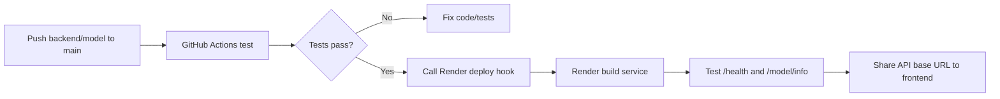

# Triển khai hệ thống (Deployment)

## Tổng quan

Hệ thống được triển khai phân tách thành 2 phần:
- **Frontend**: Triển khai trên Cloudflare Pages qua workflow `.github/workflows/deploy-cloudflare-pages.yml`.
- **Backend**: Triển khai trên Render Web Service qua workflow `.github/workflows/ci-cd.yml` kích hoạt deploy hook.

## 1. Nền tảng: Cloudflare Pages (Frontend)

## Dự án

- Dự án Cloudflare Pages: `uit-ai002-coffee-frontend`
- Nhánh chính thức (Production branch): `main`
- Nguồn mã nguồn Frontend: `frontend/`
- Thư mục đầu ra (Output folder): Thư mục sản phẩm production của Vite trong `frontend/` (thường là `frontend/dist`)

## URL

- URL Triển khai (Deployment URL): `https://faa6f859.uit-ai002-coffee-frontend.pages.dev`
- URL Dự án chính thức (Project URL): `https://uit-ai002-coffee-frontend.pages.dev`

## Lệnh biên dịch (Compile Command)

```bash
cd frontend
npm run compile
```

## Lệnh xuất bản (Publish Command)

```bash
cd frontend
PATH=$HOME/.nvm/versions/node/v22.12.0/bin:$PATH wrangler pages deploy dist --project-name uit-ai002-coffee-frontend --commit-dirty=true
```

Thay thế `dist` (nếu khác) bằng thư mục đầu ra được tạo ra bởi lệnh biên dịch production của Vite.

## GitHub Actions

Repo dùng workflow `.github/workflows/deploy-cloudflare-pages.yml` để tự động xuất bản frontend lên Cloudflare Pages khi có thay đổi trong `frontend/**` trên nhánh `main`.

Luồng CI:

1. Pull request vào `main`: cài dependency và chạy `npm run compile`.
2. Push vào `main`: cài dependency, chạy `npm run compile`, rồi xuất bản lên Cloudflare Pages.
3. Có thể chạy thủ công bằng tab GitHub Actions > Deploy Cloudflare Pages > Run workflow.

GitHub Secrets bắt buộc:

- `CLOUDFLARE_ACCOUNT_ID`: ID tài khoản Cloudflare.
- `CLOUDFLARE_API_TOKEN`: token có quyền xuất bản Cloudflare Pages.
- `VITE_AI002_API_KEY`: khóa API demo được nhúng vào frontend tại thời điểm compile.

GitHub Variables khuyến nghị:

- `VITE_API_BASE_URL`: URL backend public.

Nếu chưa có backend public, chỉ nên dùng deployment này để kiểm tra giao diện tĩnh. Luồng gọi API sẽ không hoạt động đúng ngoài local nếu `VITE_API_BASE_URL` vẫn trỏ về `127.0.0.1`.

Lưu ý bảo mật: mọi biến có tiền tố `VITE_` đều được đóng gói vào JavaScript phía trình duyệt. Vì vậy `VITE_AI002_API_KEY` không được là khóa bí mật có quyền rộng. Chỉ dùng demo key giới hạn quyền hoặc proxy backend nếu cần giữ khóa thật ở phía server.

## Biến môi trường (Environment Variables)

Frontend sử dụng các biến môi trường của Vite tại thời điểm biên dịch:

- `VITE_API_BASE_URL`: URL gốc của backend API công khai.
- `VITE_AI002_API_KEY`: Khóa API dùng thử được gửi dưới dạng header `X-API-Key`.

Nếu các biến này không được cấu hình trước khi biên dịch/xuất bản, frontend sẽ tự động dùng giá trị mặc định là `http://127.0.0.1:8000` (chỉ hoạt động trên máy local).

## Khôi phục phiên bản cũ (Rollback)

```bash
wrangler pages deployment list --project-name uit-ai002-coffee-frontend
```

Sử dụng giao diện Cloudflare Dashboard > Pages > `uit-ai002-coffee-frontend` > Deployments để chuyển đổi (promote) hoặc khôi phục (rollback) một bản triển khai.

## Ghi chú (Notes)

- Bản triển khai đầu tiên được tạo vào ngày 04-06-2026.
- Lệnh `npm run compile` đã chạy thành công trước khi xuất bản.
- Lệnh kiểm tra `curl -I` tại local bị lỗi bắt tay TLS (handshake error), nhưng Wrangler báo cáo đã triển khai thành công lên Cloudflare.
- GitHub Actions workflow đã được thêm để deploy tự động cho frontend.

## 2. Nền tảng: Render (Backend)

Backend được tự động deploy thông qua GitHub Actions (`.github/workflows/ci-cd.yml`) mỗi khi code trên nhánh `main` thay đổi. Workflow này sẽ test và gọi deploy hook URL của Render.

### Tổng quan

Backend FastAPI được triển khai trên Render Web Service để cung cấp API dự báo giá cà phê cho frontend và demo. Tài liệu này dùng khi cần cấu hình service, kiểm tra CI/CD và bàn giao URL cho frontend.

### Cấu hình Platform

| Thông số       | Giá trị                                                |
| -------------- | ------------------------------------------------------ |
| Platform       | Render Web Service                                     |
| Account        | Team Render account                                    |
| Service Name   | `ai002-coffee-api`                                     |
| Runtime        | Python                                                 |
| Build Command  | `pip install -r requirements.txt`                      |
| Start Command  | `uvicorn backend.main:app --host 0.0.0.0 --port $PORT` |
| Production URL | `https://ai002-coffee-api.onrender.com`                |

### Luồng triển khai ngắn gọn



### CI/CD GitHub Actions

Backend sử dụng GitHub Actions để tự động test và deploy lên Render:

#### Workflow Structure

```yaml
## 2. Nền tảng: Render (Backend)

Backend được tự động deploy thông qua GitHub Actions (`.github/workflows/ci-cd.yml`) mỗi khi code trên nhánh `main` thay đổi. Workflow này sẽ test và gọi deploy hook URL của Render.
on:
  push:
    branches: [main]
    paths: ["backend/**", "model/**", "requirements.txt"]
  pull_request:
    branches: [main]
    paths: ["backend/**", "model/**", "requirements.txt"]

jobs:
  test:
    - Chạy pytest tests/ai-tests/
    - Chạy flake8 lint (max-line-length=120)
    - Chạy bandit security scan (không fail build)
  deploy:
    - Chỉ chạy khi test pass và push vào main
    - Gọi Render deploy hook URL
```

#### Path Filter

Workflow chỉ trigger khi thay đổi:

- `backend/**` - Backend API code
- `model/**` - Model training code
- `requirements.txt` - Dependencies

Thay đổi frontend, crawler, docs sẽ không trigger deploy.

#### Setup GitHub Secret

1. Vào GitHub repo: Settings → Secrets and variables → Actions
2. Thêm secret:
   - Name: `RENDER_DEPLOY_HOOK_URL`
   - Value: Render deploy hook lấy từ dashboard. Không ghi giá trị thật vào tài liệu hoặc commit.

#### Disable Render Native Integration

**QUAN TRỌNG:** Tắt Render native GitHub integration để tránh double deploy:

1. Đăng nhập Render dashboard bằng team Render account
2. Vào service `ai002-coffee-api`
3. Tab "Events" → tìm GitHub integration settings
4. Disable native GitHub integration (disconnect repo hoặc turn off auto-deploy)

### Quy trình Setup trên Render

#### Bước 1: Kết nối Repository

1. Đăng nhập vào Render dashboard bằng team Render account
2. Kết nối GitHub repository `uit-25730053-baophuc/AI002_BaiTapNhom`

#### Bước 2: Tạo Web Service

1. Tạo New Web Service
2. Cấu hình thủ công (không dùng render.yaml):
   - Runtime: Python
   - Build Command: `pip install -r requirements.txt`
   - Start Command: `uvicorn backend.main:app --host 0.0.0.0 --port $PORT`

#### Bước 3: Cấu hình Environment Variable

1. Trong tab Environment, thêm biến:
   - Key: `AI002_API_KEY`
   - Value: Khóa API private cho team demo (không commit vào repo)
2. Lưu cấu hình

#### Bước 4: Triển khai

1. Setup GitHub secret `RENDER_DEPLOY_HOOK_URL`
2. Disable Render native GitHub integration
3. Push code vào main → GitHub Actions tự động test và deploy
4. Chờ build thành công và service running
5. Xác nhận production URL

### Bảo mật Endpoint

| Endpoint        | Method | Protected | Auth Required | Mô tả                                        |
| --------------- | ------ | --------- | ------------- | -------------------------------------------- |
| `/`             | GET    | Không     | None          | Trang chào công khai                         |
| `/health`       | GET    | Không     | None          | Health check công khai cho Render monitoring |
| `/docs`         | GET    | Không     | None          | Swagger UI công khai                         |
| `/openapi.json` | GET    | Không     | None          | OpenAPI spec công khai                       |
| `/model/info`   | GET    | Có        | API Key       | Trả về metadata model, features, version     |
| `/predict`      | POST   | Có        | API Key       | Trả về dự báo giá + khuyến nghị canh tác     |

### Cấu hình API Key

| Thông số                      | Giá trị                                             |
| ----------------------------- | --------------------------------------------------- |
| Env Var Name                  | `AI002_API_KEY`                                     |
| Header Name                   | `X-API-Key`                                         |
| Hành vi khi key sai           | `401 Unauthorized`                                  |
| Hành vi khi env var không set | `503 Service Unavailable`                           |
| Phương thức so sánh           | Constant-time comparison (`secrets.compare_digest`) |

Ví dụ gọi endpoint protected:

```bash
curl -H "X-API-Key: replace-with-team-demo-key" \
  https://ai002-coffee-api.onrender.com/model/info
```

### Lưu ý Bảo mật

- API key chỉ là **demo gate**, không phải auth production
- Key ở client-side có thể bị extract từ browser/frontend
- Rotate key nếu chia sẻ ngoài team
- Không commit key vào repo
- Không log key trong app logs
- Không đưa Render deploy hook URL thật vào README, issue, pull request hoặc slide

### Định dạng Báo cáo Lỗi

Thành viên dự án báo lỗi với thông tin:

1. **Endpoint**: `/predict`, `/model/info`, v.v.
2. **Request Payload**: JSON body hoặc query params
3. **Status Code**: HTTP response code
4. **Response Body**: Thông báo lỗi đầy đủ
5. **Timestamp**: Thời gian xảy ra lỗi
6. **Browser Console**: Nếu là lỗi integration frontend

Ví dụ:

```
Endpoint: POST /predict
Payload: {"province": "Dak Lak", "month": 5, ...}
Status: 422
Response: {"detail": "Invalid coffee_type value"}
Timestamp: 2026-05-27 10:30:00
Console: None
```

### Checklist sau deploy

- `GET /health` trả `200` và `model_loaded=true`
- `GET /model/info` thiếu key trả `401`
- `GET /model/info` đúng key trả `200`
- `POST /predict` đúng key trả `200` hoặc `422` nếu payload sai
- Swagger UI mở được tại `/docs`
- Nếu frontend chạy trên domain khác và bị CORS, cần thêm domain đó vào backend trước demo

### Chiến lược Deploy Branch

- **Hiện tại**: GitHub Actions deploy tự động khi push vào main (sau khi tests pass)
- **Không enforce branch protection**: Dự án học tập, không muốn rào cản
- **Path filter**: Chỉ deploy khi thay đổi backend/model/requirements

### Ghi chú Vận hành

- **Cold Start**: Render Free tier có thể mất 30-60s trên request đầu tiên sau khi idle
- **Pre-demo**: Gọi `/health` trước demo để warm up service
- **Rollback**: Dùng Render dashboard Events -> previous deploy -> Manual Deploy
- **Logs**: Nguồn chính để điều tra incident trong Render dashboard

### Tài liệu Liên quan

- API schema: `backend/schemas/prediction.py`
- Project Roadmap: `docs/project-roadmap.md`
- Code Standards: `docs/code-standards.md`
- Local/self-host: xem mục "Hướng dẫn chạy Backend Local và Self-host" trong tài liệu này

## 3. Hướng dẫn chạy Backend Local và Self-host

Tài liệu này dành cho thành viên cần chạy backend FastAPI để test frontend, demo nội bộ hoặc host nhanh trên một máy Linux. Không cần hiểu sâu về Python, chỉ cần làm đúng từng bước.

### 1. Khi nào dùng tài liệu này

| Nhu cầu | Nên làm |
| --- | --- |
| Test frontend trên máy cá nhân | Chạy mục 2, 3 và 4 |
| Demo nội bộ qua cùng mạng LAN | Chạy mục 2, 3, 4 và mở port máy host |
| Host lâu dài trên server Linux | Làm thêm mục 6 và 7 |
| Deploy public cho cả team | Người phụ trách backend chọn nền tảng, sau đó chia sẻ base URL và API key nội bộ |

### 2. Chuẩn bị môi trường

Mở terminal tại thư mục gốc repo, sau đó chạy:

```bash
python3 -m venv venv
source venv/bin/activate
pip install -r requirements.txt
```

Windows PowerShell:

```powershell
python -m venv venv
.\venv\Scripts\Activate.ps1
pip install -r requirements.txt
```

### 3. Cấu hình API key

API key dùng để chặn người ngoài gọi `/predict` và `/model/info`. Không commit key, không gửi key vào group công khai.

macOS/Linux:

```bash
export AI002_API_KEY="replace-with-team-demo-key"
```

Windows PowerShell:

```powershell
$env:AI002_API_KEY="replace-with-team-demo-key"
```

Team lead lấy key thật từ kênh nội bộ của nhóm. Nếu chưa có key, tự tạo một chuỗi dài khó đoán rồi chia riêng cho người cần test.

### 4. Chạy backend local

macOS/Linux:

```bash
python3 -m uvicorn backend.main:app --host 0.0.0.0 --port 8000
```

Windows PowerShell:

```powershell
python -m uvicorn backend.main:app --host 0.0.0.0 --port 8000
```

Sau khi chạy thành công:

- Swagger UI: `http://localhost:8000/docs`
- Health check: `http://localhost:8000/health`
- API base URL cho frontend local: `http://localhost:8000`

### 5. Test nhanh API

Health check không cần API key:

```bash
curl http://localhost:8000/health
```

Endpoint protected cần header `X-API-Key`:

```bash
curl -H "X-API-Key: replace-with-team-demo-key" \
  http://localhost:8000/model/info
```

Kết quả thường gặp:

| Kết quả | Ý nghĩa | Cách xử lý |
| --- | --- | --- |
| `200` | API chạy đúng | Có thể nối frontend |
| `401` | Thiếu hoặc sai API key | Kiểm tra header `X-API-Key` |
| `503` | Thiếu cấu hình hoặc model chưa sẵn sàng | Kiểm tra `AI002_API_KEY` và file `model/best_model/model.pkl` (đã được commit sẵn trong repo) |
| `422` | Payload sai schema hoặc category ngoài tập train | So lại với API handoff doc |

### 6. Self-host trên Linux bằng systemd

Chỉ dùng khi cần server chạy nền ổn định. Ví dụ repo nằm ở `/opt/ai002`.

Tạo file service:

```bash
sudo nano /etc/systemd/system/ai002-backend.service
```

Nội dung mẫu:

```ini
[Unit]
Description=AI002 Coffee Forecast Backend
After=network.target

[Service]
WorkingDirectory=/opt/ai002
Environment=AI002_API_KEY=replace-with-team-demo-key
ExecStart=/opt/ai002/venv/bin/python -m uvicorn backend.main:app --host 127.0.0.1 --port 8000
Restart=always
RestartSec=5

[Install]
WantedBy=multi-user.target
```

Khởi động service:

```bash
sudo systemctl daemon-reload
sudo systemctl enable ai002-backend
sudo systemctl start ai002-backend
sudo systemctl status ai002-backend
```

Xem log khi lỗi:

```bash
sudo journalctl -u ai002-backend -n 100 --no-pager
```

### 7. Nginx reverse proxy

Nếu cần domain public, dùng Nginx chuyển request về FastAPI.

```nginx
server {
    server_name api.example.com;

    location / {
        proxy_pass http://127.0.0.1:8000;
        proxy_set_header Host $host;
        proxy_set_header X-Real-IP $remote_addr;
        proxy_set_header X-Forwarded-For $proxy_add_x_forwarded_for;
        proxy_set_header X-Forwarded-Proto $scheme;
    }
}
```

Sau đó cấu hình HTTPS bằng Certbot theo hướng dẫn hệ điều hành/server đang dùng.

### 8. Lưu ý cho frontend

- Gọi `GET /health` trước demo để kiểm tra backend đã thức.
- Gọi `/predict` và `/model/info` kèm header `X-API-Key`.
- Nếu browser báo CORS, thêm domain frontend vào FastAPI trước khi demo public.
- Không hard-code API key thật vào file frontend được commit lên Git.

### 9. Bàn giao cho frontend

Khi backend đã chạy ở local, LAN hoặc server public, người phụ trách backend chỉ cần gửi cho frontend:

- API base URL, ví dụ `http://localhost:8000` hoặc URL server public
- API key nội bộ để gửi qua header `X-API-Key`
- Trạng thái `/health`
- Ghi chú nếu server có cold start, giới hạn mạng nội bộ hoặc CORS

### 10. Tài liệu liên quan

- API schema: `backend/schemas/prediction.py`
- Sửa lỗi thường gặp: `docs/troubleshooting.md`
