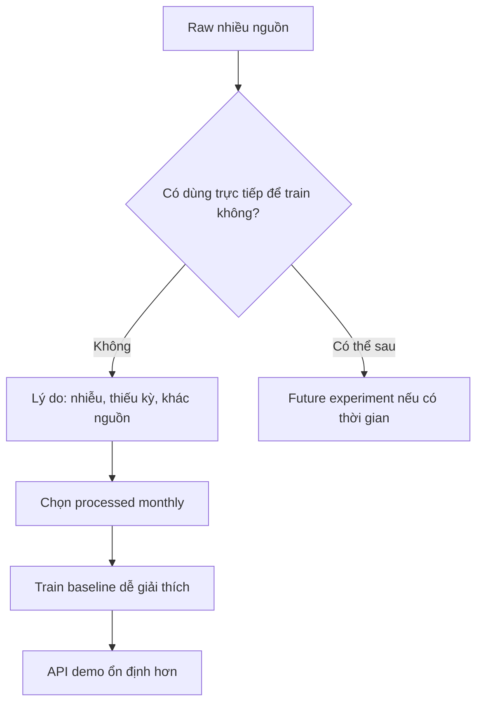
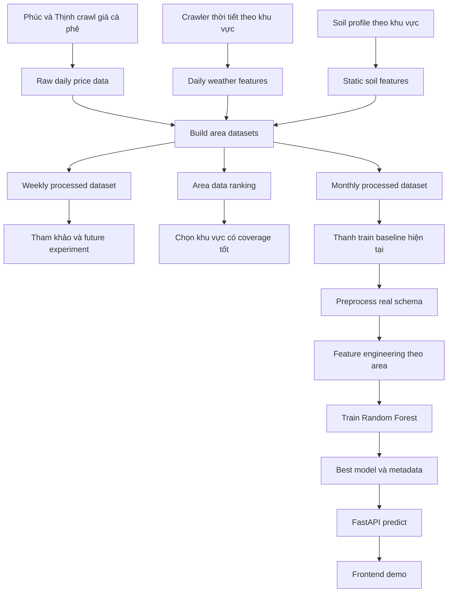
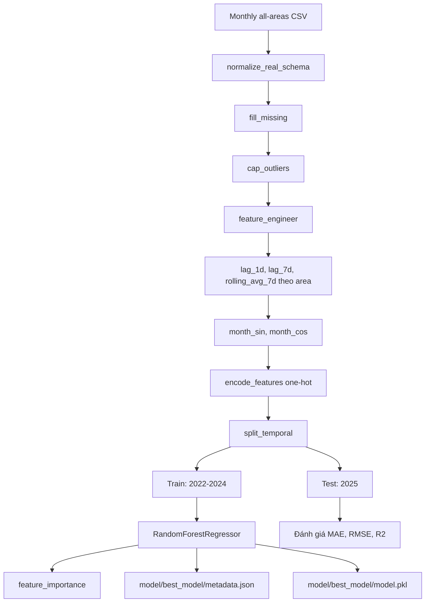
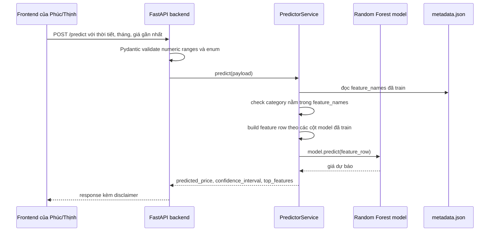
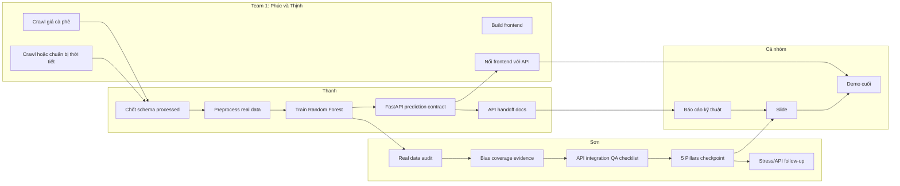
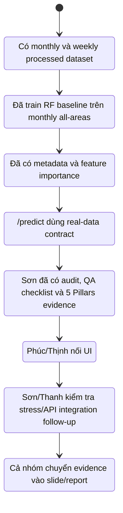
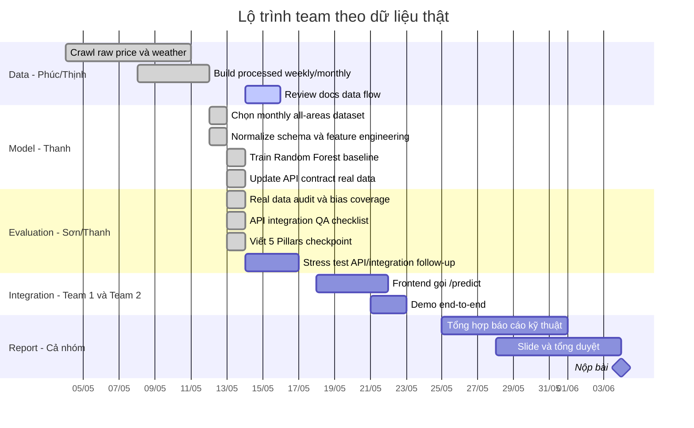

# Team Data Flow Roadmap — 13/05/2026

## Mục tiêu

Tài liệu này giúp Thanh, Sơn, Phúc, Thịnh nhìn cùng một bức tranh: dữ liệu từ crawler đi vào đâu, Team 2 xử lý thế nào, model sinh ra API gì, và frontend cần dùng phần nào.

Đây là bản draft để Team 2 unblock hiểu biết nội bộ. Phúc nên review lại phần crawler, nguồn dữ liệu và giả định processed dataset.

## Quyết định dữ liệu hiện tại

| Nhóm dữ liệu      | File chính                                                                  | Vai trò hiện tại                                                 |
| :---------------- | :-------------------------------------------------------------------------- | :--------------------------------------------------------------- |
| Raw giá crawl     | `data/raw/coffee_price_all_areas_daily_2022_2025.csv`                       | Nguồn gốc giá thật, gitignored, không train trực tiếp trong repo |
| Weekly processed  | `data/processed/weekly/coffee_environment_all_areas_weekly_2022_2025.csv`   | Tham khảo, future experiment, coverage thấp hơn monthly          |
| Monthly processed | `data/processed/monthly/coffee_environment_all_areas_monthly_2022_2025.csv` | Dataset chính để train baseline hiện tại                         |
| Ranking coverage  | `data/processed/area_real_price_data_ranking.csv`                           | Kiểm tra khu vực nào có giá thật tốt                             |
| Field spec        | `data/processed/FIELD_DESCRIPTIONS.md`                                      | Giải thích schema cho team                                       |

## Vì sao chọn monthly thay vì dùng hết raw/weekly

- Raw nhiều nguồn và nhiều dòng, nhưng nằm trong `data/raw/` gitignored và chưa đồng đều theo khu vực/thời gian.
- Weekly có nhiều dòng hơn nhưng coverage giá thật thấp hơn monthly.
- Monthly có ít dòng hơn nhưng ổn định hơn, dễ giải thích hơn, hợp baseline Random Forest hơn.
- Mục tiêu môn học là chứng minh tư duy AI bền vững, không phải nhồi dữ liệu tối đa bằng mọi giá.

## Luồng dữ liệu tổng quan

## Luồng model chi tiết

## Luồng API và frontend

## Phân công trách nhiệm

## Trạng thái hiện tại sau PR real-data baseline

## Cột mốc theo tuần

## Những điểm Phúc cần review

- Raw source list và nguồn nào là chính.
- Cách build `data/processed/weekly` và `data/processed/monthly`.
- Ý nghĩa `price_fill_method` và khi nào là `observed`, `interpolated_area`, `province_proxy`.
- Có cần expose thêm `price_observations` trên frontend hay backend tự default theo `price_fill_method`.
- Các khu vực có coverage yếu, đặc biệt `Dak R'lap`.
- Frontend nên cho user chọn field nào, field nào để default backend.

## Phần Sơn đã cover trong PR #12 và follow-up

- Đã có real data audit cho monthly/weekly, coverage theo tỉnh/khu vực và cảnh báo Dak Nong/Dak R'lap.
- Đã có 5 Pillars checkpoint real-data, gồm Reliability metrics, Bias risk, Robustness validation, Social Impact disclaimer và Transparency feature importance.
- Đã có API/frontend integration QA checklist cho `/health`, `/predict`, `/model/info`, unknown category, invalid range và model missing.
- Follow-up còn lại: chạy smoke test/stress test ở tuần integration, rồi chuyển evidence vào slide/report cuối kỳ.

Tài liệu Sơn liên quan:

- [`2026-05-13-real-data-audit-team2-son.md`](2026-05-13-real-data-audit-team2-son.md)
- [`2026-05-13-son-api-integration-qa-checklist.md`](2026-05-13-son-api-integration-qa-checklist.md)
- [`2026-05-13-son-evaluation-pack-summary.md`](2026-05-13-son-evaluation-pack-summary.md)
- [`5-pillars-checkpoint.md`](5-pillars-checkpoint.md)

## Nguyên tắc báo cáo

- Nói rõ model hiện tại là baseline, chưa phải model cuối.
- Nói rõ monthly được chọn vì ổn định và dễ giải thích hơn weekly.
- Không nói “dùng hết data” mà nói “dùng bản processed phù hợp nhất cho baseline”.
- Nhấn mạnh API có validation và disclaimer để tránh hiểu nhầm dự báo là lời khuyên tài chính.
