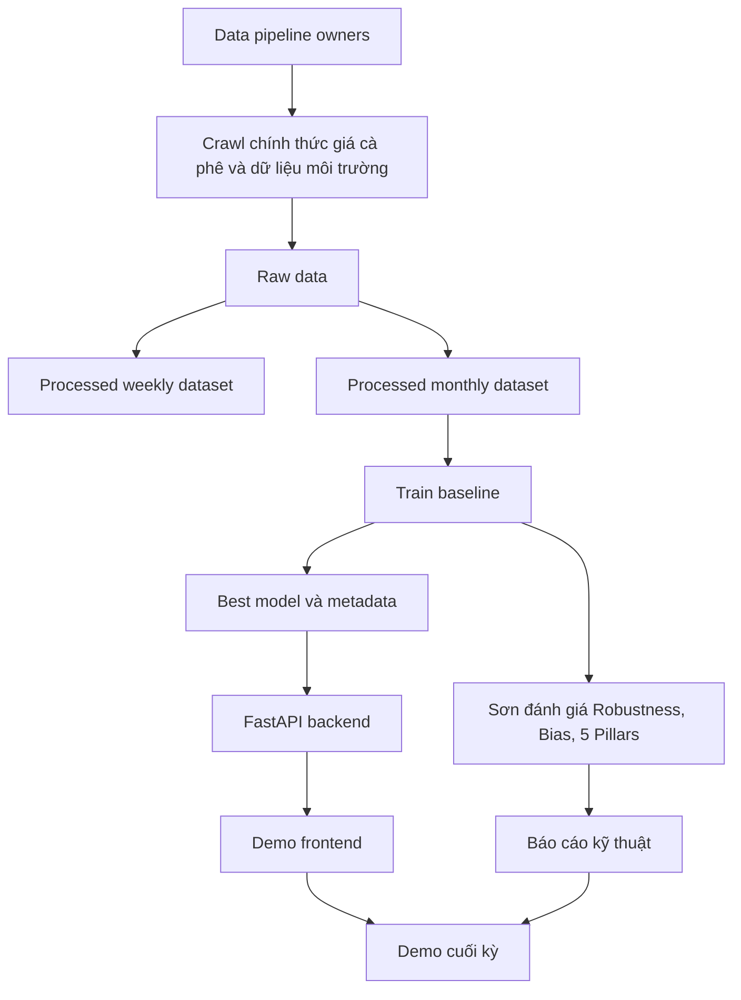
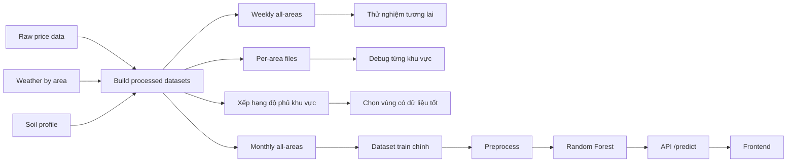
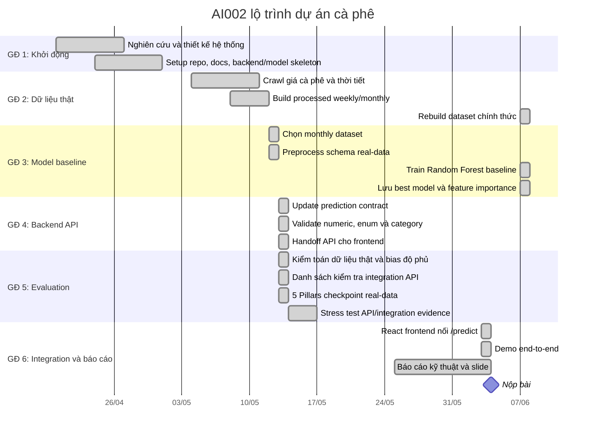
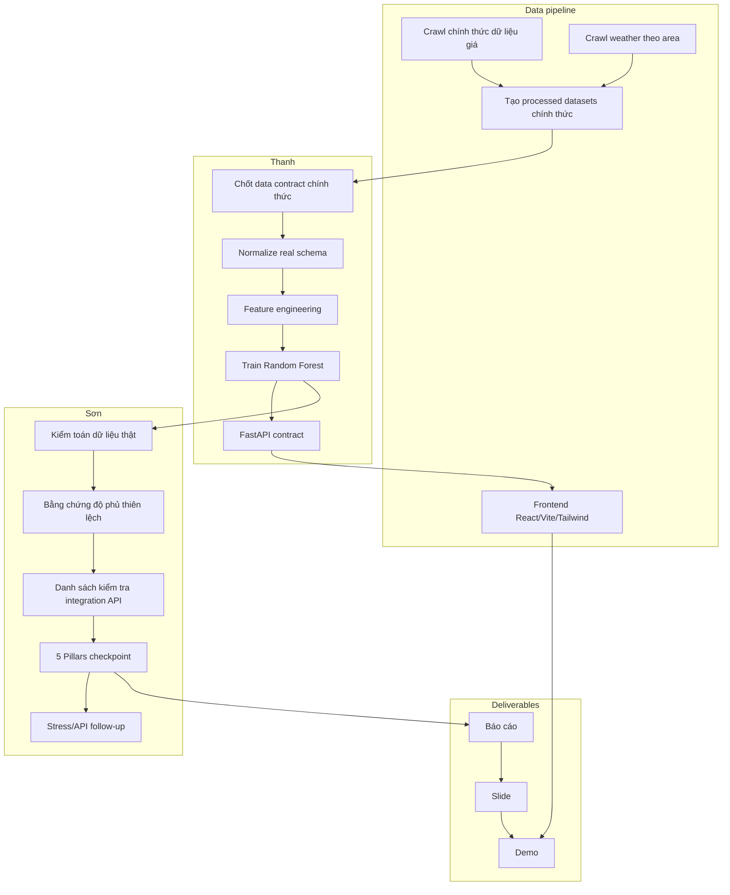
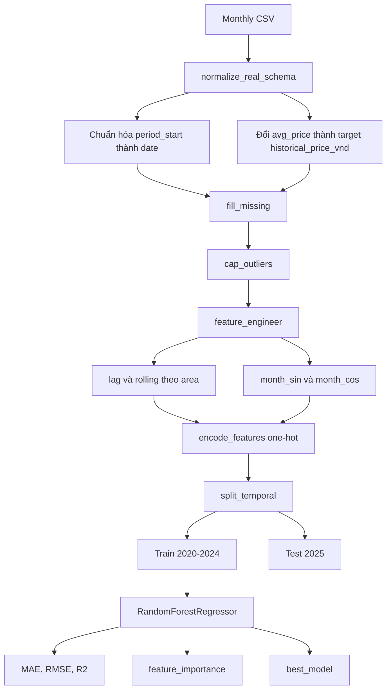
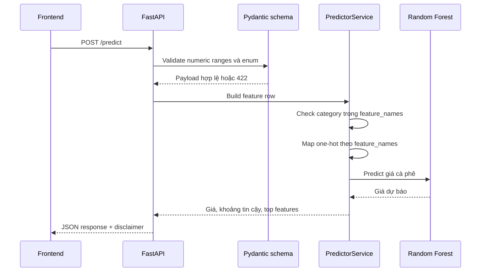
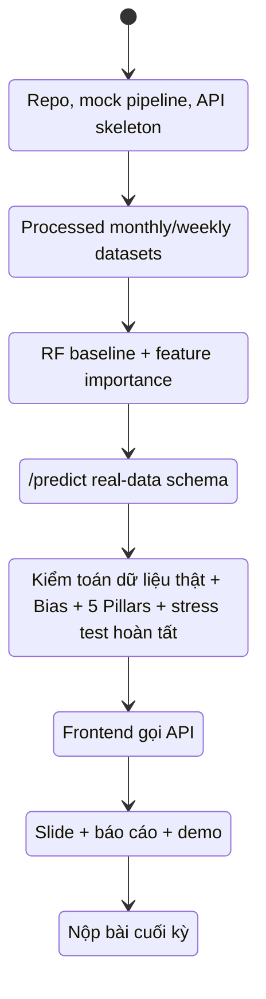
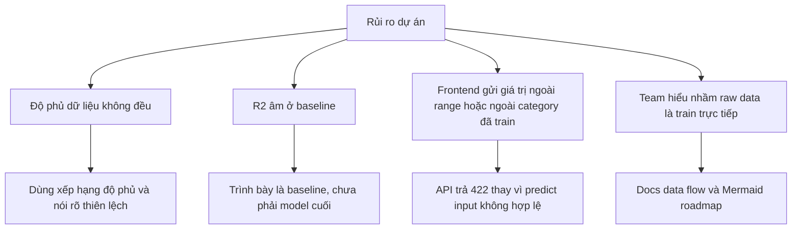

# Lộ trình Dự án và Luồng Dữ liệu

Tài liệu này mô tả roadmap tổng quan cho **AI002 - Đề tài 10: AI dự báo canh tác và giá cà phê**, tập trung vào luồng dữ liệu chính thức được thu thập, audit và tạo lại, sau đó đi qua model, API và frontend.

**Trạng thái hiện tại:** roadmap phản ánh trạng thái cập nhật tính đến 2026-06-07 sau khi tách nhóm và rebuild dataset chính thức.

## Bức tranh tổng quan

## Luồng dữ liệu từ raw đến demo

## Quyết định dùng dữ liệu

| Nhóm              | File                                                                        | Mục đích                        | Trạng thái                                   |
| :---------------- | :-------------------------------------------------------------------------- | :------------------------------ | :------------------------------------------- |
| Raw giá crawl     | `data/raw/coffee_price_all_areas_daily_2020_2026.csv`                       | Nguồn giá public tự crawl lại   | Gitignored, không train trực tiếp trong repo |
| Weekly processed  | `data/processed/weekly/coffee_environment_all_areas_weekly_2020_2026.csv`   | Tham khảo, thử nghiệm tương lai | Chưa dùng làm baseline chính                 |
| Monthly processed | `data/processed/monthly/coffee_environment_all_areas_monthly_2020_2026.csv` | Dataset train chính             | Đã dùng cho baseline chính thức                 |
| Xếp hạng độ phủ   | `data/processed/area_real_price_data_ranking.csv`                           | Đánh giá độ phủ khu vực         | Đã dùng để quyết định                        |

Lý do chọn monthly: ít nhiễu hơn weekly, độ phủ giá thật tốt hơn, dễ giải thích trong báo cáo, phù hợp KISS.

## Roadmap tổng thể

## Phân công trách nhiệm

## Luồng xử lý trong model

## Luồng request API

## Trạng thái theo milestone

## Theo dõi tiến độ tuần

### Tuần 1-2 — Khởi động

- [x] Khởi tạo repo và Git setup.
- [x] Chốt đề tài dự báo giá cà phê.
- [x] Viết PDR và 5 trụ cột AI.
- [x] Setup cấu trúc backend, model, crawler, frontend.

### Tuần nghỉ lễ — Foundation pipeline

- [x] Chạy mock pipeline.
- [x] Có FastAPI skeleton.
- [x] Có Random Forest baseline trên mock data.

### Tuần 3 — Data thật

- [x] Thu thập và tạo lại processed weekly/monthly dataset chính thức.
- [x] Đọc và chuẩn hóa schema real-data.
- [x] Có xếp hạng độ phủ dữ liệu theo khu vực.
- [x] Ghi rõ provenance dữ liệu được thu thập/tái tạo từ nguồn public.

### Tuần 4 — Model thật

- [x] Train Random Forest baseline trên monthly all-areas chính thức.
- [x] Trích xuất feature importance.
- [x] Lưu best model và metadata.
- [x] Sơn bổ sung kiểm toán dữ liệu thật, bias độ phủ bằng chứng và 5 Pillars checkpoint trong PR #12.
- [x] Chạy stress test tự động cho kịch bản cực đoan (Black Swan) trên dữ liệu thật.

### Tuần 5 — API và Integration

- [x] Hoàn thiện `/predict`, `/health`, `/model/info` theo real-data contract.
- [x] API validate numeric ranges, enum và category đã train.
- [x] Bổ sung danh sách kiểm tra integration API/frontend.
- [x] Có frontend demo mobile-first trong repo gọi `/predict`.
- [x] Demo end-to-end backend/frontend bằng kịch bản Lâm Đồng / Di Linh.

### Tuần 6 — Báo cáo và slide

- [x] Có 5 Pillars checkpoint real-data từ PR #12 và checkpoint chính thức 2026-06-07.
- [x] Chuyển bằng chứng 5 Pillars và stress test vào slide/report cuối kỳ.
- [x] Chuẩn bị slide thuyết trình (final_presentation_slides.md).
- [x] Tổng duyệt demo bằng API smoke test và frontend screenshot evidence.

## WBS cập nhật

| Phân hệ            | Nội dung                                    | Người phụ trách | Review cần có                      |
| :----------------- | :------------------------------------------ | :-------------- | :--------------------------------- |
| Data crawler       | Crawl giá, weather, tạo processed dataset chính thức | Thanh, Sơn      | Thanh review schema                |
| Data understanding | Giải thích raw/weekly/monthly, độ phủ       | Thanh, Sơn      | Sơn review cho evaluation          |
| AI model           | Preprocess, train RF, feature importance    | Thanh           | Sơn review metrics                 |
| Evaluation         | Stress test, bias, 5 Pillars                | Sơn             | Thanh review technical correctness |
| Backend API        | `/predict`, `/health`, `/model/info`        | Thanh           | Review frontend contract           |
| Frontend           | React/Vite/Tailwind UI và gọi API          | Nhóm phát triển | Thanh review payload/response      |
| Report             | Kết quả, limitation, demo script            | Cả nhóm         | Cả nhóm review                     |

## Rủi ro và cách xử lý

## Tài liệu liên quan

- [`docs/discussions/2026-05-13-son-evaluation-pack-summary.md`](discussions/2026-05-13-son-evaluation-pack-summary.md)
- [`docs/discussions/robustness-stress-test.md`](discussions/robustness-stress-test.md)
- [`data/processed/FIELD_DESCRIPTIONS.md`](../data/processed/FIELD_DESCRIPTIONS.md)
- [`data/processed/AREA_REAL_PRICE_DATA_RANKING.md`](../data/processed/AREA_REAL_PRICE_DATA_RANKING.md)
