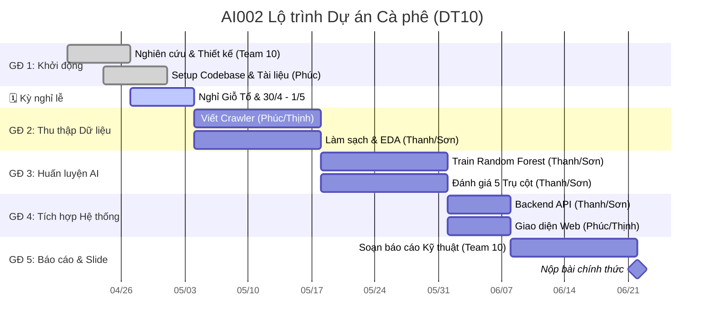

# Lộ trình Dự án (Project Roadmap)

Dưới đây là lịch trình làm việc và lộ trình phát triển chính cho **Team 10**, bám sát theo kế hoạch song song hóa giữa Team 1 (Crawler/UI) và Team 2 (Core AI).

## 🗺️ Lộ trình tổng thể (Gantt Chart)

---

## 📈 Theo dõi Tiến độ (Weekly Tracker)

### Tuần 1-2 (Khởi động) — Tháng 04/2026

- [x] Khởi tạo repo & Git setup.
- [x] Chốt đề tài: Dự báo giá cà phê.
- [x] Viết tài liệu PDR định hình kiến trúc và 5 Trụ cột AI.
- [x] Setup cấu trúc thư mục codebase (backend, model, crawler).
- [ ] Chốt định dạng file CSV để crawl.

---

## 🏗️ Phân chia Công việc chi tiết (WBS)

| Phân hệ      | Nội dung                                   | Người phụ trách | Hỗ trợ  |
| :----------- | :----------------------------------------- | :-------------- | :------ |
| **Dữ liệu**  | Viết crawler thời tiết, giá cà phê lịch sử | Phúc, Thịnh     | Thanh   |
| **AI Model** | Tiền xử lý, Train Random Forest, XGBoost   | Thanh           | Sơn     |
| **Backend**  | API FastAPI, Validate dữ liệu (Pydantic)   | Thanh           | Sơn     |
| **Frontend** | Giao diện Web HTML/JS/CSS hiển thị dự báo  | Phúc            | Thịnh   |
| **Báo cáo**  | Slide thuyết trình, Báo cáo 5 Trụ cột      | Cả nhóm (T10)   | Cả nhóm |

---

## 🚩 Các cột mốc chính (Milestones)

1. **M1: Nền tảng (Cuối tháng 4)** — Hoàn tất setup repo và thiết kế hệ thống.
2. **M2: Dữ liệu (Đầu tháng 5)** — Thu thập đủ bộ dataset thô và làm sạch cơ bản.
3. **M3: Mô hình (Giữa tháng 5)** — Có model Baseline dự báo được giá, đo được sai số.
4. **M4: Tích hợp (Đầu tháng 6)** — Có API chạy thật và nối được lên Web.
5. **M5: Nộp bài (Giữa tháng 6)** — Xong slide, báo cáo bảo vệ đồ án.
