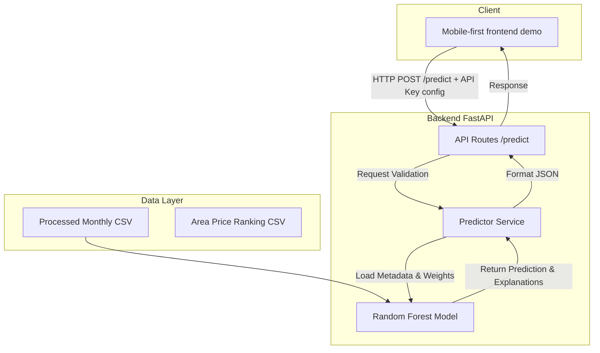

# 🏗️ Kiến trúc Hệ thống (System Architecture)

Tài liệu này mô tả chi tiết kiến trúc hệ thống của dự án **AI Dự báo Canh tác & Giá Cà phê (Đề tài 10 - Team 10)**.

---

## 1. Tổng quan Hệ thống (System Overview)

Hệ thống được thiết kế theo mô hình client-server đơn giản (KISS & YAGNI) nhằm phục vụ việc dự báo giá nông sản và gợi ý canh tác cho nông dân nhỏ lẻ. Hệ thống gồm 4 thành phần chính:
1. **Data Pipeline (Crawler & Preprocess):** Thu thập dữ liệu từ các nguồn giá thật và thời tiết, làm sạch và tổng hợp thành các tập dữ liệu processed theo tuần/tháng.
2. **AI/ML Core:** Mô hình học máy Random Forest huấn luyện trên dữ liệu monthly đã chuẩn hóa, trích xuất feature importance và dự báo có khoảng tin cậy.
3. **Backend API (FastAPI):** Cung cấp các endpoint để frontend gọi dự báo, đồng thời bảo mật bằng API Key.
4. **Mobile-first Frontend Demo (React/Vite/Tailwind):** Giao diện được xây dựng bằng React/Vite trong `frontend/`, style bằng Tailwind và theme coffee/cream/leaf. UI có màn chào, menu chọn tác vụ, tách luồng Giá và luồng Canh tác, tối ưu thao tác di động. Hiển thị dự báo, độ tin cậy, feature importance, khuyến nghị canh tác, hỗ trợ lưu lịch sử cục bộ khi người dùng chủ động bấm lưu, xem chi tiết lịch sử và cảnh báo dữ liệu.

---

## 2. Luồng Dữ liệu (Data Pipeline)

Luồng dữ liệu đi qua các bước từ thu thập thô đến huấn luyện và dự báo:

- **Thu thập (Crawling):** Dữ liệu giá cà phê hàng ngày được crawler thu thập từ các trang tin thị trường. Dữ liệu thời tiết được lấy theo khu vực.
- **Xử lý (Processing):** Gộp dữ liệu giá, thời tiết và đất đai. Tạo ra hai phiên bản: weekly (tuần) và monthly (tháng).
- **Lựa chọn (Selection):** Nhóm chọn tập monthly làm tập train chính vì độ bao phủ (coverage) của dữ liệu giá thật ổn định hơn, ít nhiễu và dễ giải thích.
- **Huấn luyện (Training):**
  - Tách tập dữ liệu theo thời gian (Temporal Split): Train từ 2022-2024, Test năm 2025.
  - Áp dụng các bước tiền xử lý: chuẩn hóa schema, điền giá trị thiếu (fill missing), xử lý outliers (cap outliers), và feature engineering (tạo các biến trễ lag, rolling, sine/cosine tháng).
  - Huấn luyện mô hình `RandomForestRegressor`.

---

## 3. Kiến trúc API (API Architecture)

API được xây dựng trên nền tảng **FastAPI**, tự động sinh tài liệu OpenAPI (Swagger UI tại `/docs`) hỗ trợ trụ cột **Transparency (Minh bạch)**.

### Các Endpoint chính:
- `GET /health`: Kiểm tra trạng thái hoạt động của server và kiểm tra mô hình học máy đã được tải vào bộ nhớ hay chưa.
- `GET /model/info`: Trả về metadata của mô hình hiện tại (phiên bản, ngày train, các features sử dụng, chỉ số MAE/RMSE trên tập test). Endpoint này yêu cầu Header `X-API-Key`.
- `POST /predict`: Dự báo giá cà phê dựa trên các thông số môi trường đầu vào (thời tiết, khu vực, thời gian). Endpoint này yêu cầu Header `X-API-Key` và validate đầu vào nghiêm ngặt thông qua Pydantic.

---

## 4. Tích hợp 5 Trụ cột AI Bền vững (5 Pillars Integration)

Kiến trúc hệ thống được thiết kế xoay quanh 5 trụ cột của AI Bền vững:

1. **Reliability (Độ tin cậy):** 
   - Mô hình có phân chia temporal split rõ ràng (Train 2022-2024, Test 2025).
   - Đánh giá mô hình bằng các metrics chuẩn: MAE, RMSE, $R^2$.
2. **Bias (Tính không thiên vị):**
   - Phân tích và tài liệu hóa rõ ràng sự thiên lệch về địa lý (ví dụ: Đắk Lắk có nhiều mẫu hơn các tỉnh khác).
   - Không đưa ra các nhận định phân biệt đối xử trong dự báo.
3. **Robustness (Kháng nhiễu):**
   - Validator Pydantic chặn đứng các input không hợp lệ hoặc nằm ngoài range hợp lý ngay tại tầng API.
   - Thử nghiệm stress test giả lập các biến động cực đoan (Black Swan) như hạn hán hoặc sụp đổ giá để đo lường độ suy giảm hiệu năng của mô hình.
4. **Social Impact (Tác động xã hội):**
   - Cung cấp dự báo giá và lời khuyên canh tác trực quan để nông dân tránh bị thương lái ép giá.
5. **Transparency (Tính minh bạch):**
   - API trả về top 3 features ảnh hưởng lớn nhất đến kết quả dự báo (Feature Importance) kèm giải thích trực quan bằng tiếng Việt cho người nông dân dễ hiểu.
