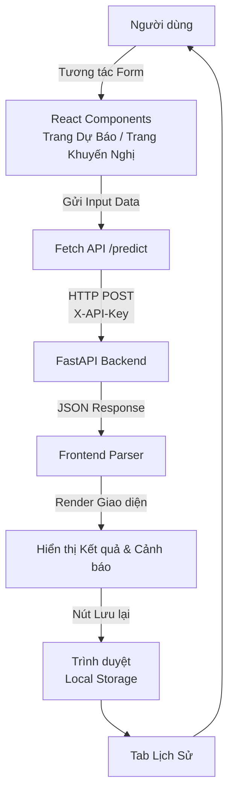

# 🌐 Frontend (Giao diện Người Dùng)

Giao diện Demo Dự báo Giá & Khuyến nghị Canh tác Cà phê (DT10). 
Giao diện được thiết kế theo triết lý **Social Impact & Accessibility** để có thể chạy mượt mà ngay cả trên thiết bị di động cấu hình yếu tại vùng sâu Tây Nguyên.

## 1. Vai trò

- Cung cấp giao diện trực quan cho Nông dân / Nhà môi giới nhập thông số môi trường & kỹ thuật.
- Trình bày kết quả Dự báo Giá và Lời khuyên canh tác dễ hiểu, độ tương phản cao (Neo-Brutalism).
- Giao tiếp trực tiếp với hệ thống Backend thông qua API HTTP RESTful.
- Cảnh báo dữ liệu lệch (Bias Warning) ở các vùng ít mẫu dữ liệu, hướng tới sự minh bạch.

## 2. Sơ đồ luồng xử lý (Data Flow & Architecture)



## 3. Chức năng các thư mục/file chính

- **`src/app/App.tsx`**: Khung ứng dụng chính, quản lý định tuyến nội bộ (Tabs).
- **`src/shared/components/`**: Chứa các thẻ UI dùng chung (Button, Card, Form Input).
- **`src/shared/api/`, `src/shared/storage/`, ...**: Các hàm utility, bao gồm hàm gọi API, lưu trữ.
- **`vite.config.ts` & `tailwind.config.js`**: Cấu hình build system và hệ thống màu sắc, typography.

## 4. Hướng dẫn chạy Demo

Vì sử dụng Vite, bạn cần cài đặt NodeJS và chạy bằng npm:

```bash
cd frontend
npm install
npm run dev
```

Sau đó mở trình duyệt truy cập: `http://localhost:5173`.

> **Lưu ý:** Đảm bảo Backend Uvicorn đã được bật (`uvicorn backend.main:app --reload`) ở cổng 8000 để Frontend có thể fetch data thành công. Frontend sẽ ưu tiên biến môi trường `VITE_AI002_API_KEY` để gọi API.

## 5. Roadmap Tiến độ

- [x] Chuyển đổi từ Vanilla tĩnh sang React + Vite + TypeScript
- [x] Thiết kế hệ thống UI Neo-Brutalism (A11y, High Contrast)
- [x] Tích hợp lấy dữ liệu API thực tế từ Backend
- [x] Tính năng Lưu Lịch Sử (Local Storage)
- [x] Cảnh báo Bias vùng miền (Social Impact Pillar)
- [ ] Bổ sung biểu đồ trực quan lịch sử biến động giá theo tháng (Tương lai)
