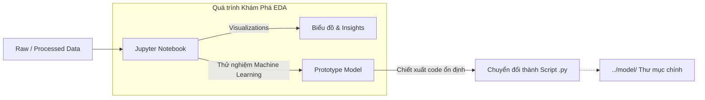

# 📓 Notebooks (EDA & Prototyping)

Thư mục này chứa các file Jupyter Notebook (`.ipynb`) dùng để thử nghiệm ý tưởng, phân tích dữ liệu thăm dò (Exploratory Data Analysis - EDA), và xây dựng các nguyên mẫu (prototype) mô hình trước khi chuyển hóa thành các đoạn code Python chuẩn mực chạy trong pipeline hệ thống (thư mục `model/`).

## 1. Vai trò

- Khám phá tập dữ liệu, vẽ biểu đồ phân phối giá, phát hiện nhiễu (outliers) và xu hướng theo thời gian.
- Kiểm thử nhanh các giả thuyết đặc trưng (Feature Hypothesis Testing) mà không sợ làm hỏng code hệ thống.
- Cung cấp một tệp minh chứng (End-to-End) có thể chạy từng ô code một cách trực quan, rất phù hợp cho mục đích giảng dạy và báo cáo môn học.

## 2. Sơ đồ luồng xử lý (Data Flow & Architecture)



## 3. Chức năng các file chính

- **`ai002_final_pipeline.ipynb`**: File Notebook cốt lõi đóng gói toàn bộ quy trình của dự án. Nó bao gồm các bước từ load data (EDA), Preprocessing (Tiền xử lý), Training Baseline, đến việc Plot Feature Importance. Nó đóng vai trò là một tài liệu sống (living document), minh chứng rõ ràng nhất về vòng đời phát triển dự án.

## 4. Hướng dẫn chạy

Nếu bạn dùng VS Code, có thể cài đặt Extension **Jupyter** và chạy trực tiếp từng Cell trong file `.ipynb`. 
Để chạy bằng web, hãy cài đặt `jupyter` và khởi động:

```bash
pip install jupyter
jupyter notebook notebooks/ai002_final_pipeline.ipynb
```

## 5. Roadmap Tiến độ

- [x] Xây dựng Notebook tổng hợp End-to-End (`ai002_final_pipeline.ipynb`)
- [ ] Cập nhật thêm Notebook phân tích riêng về Error/Bias Analysis (Phân tích lỗi của mô hình) (Tương lai)
- [ ] Bổ sung các bản Notebook xử lý EDA riêng biệt cho từng bài báo cáo chuyên đề (Tương lai)
